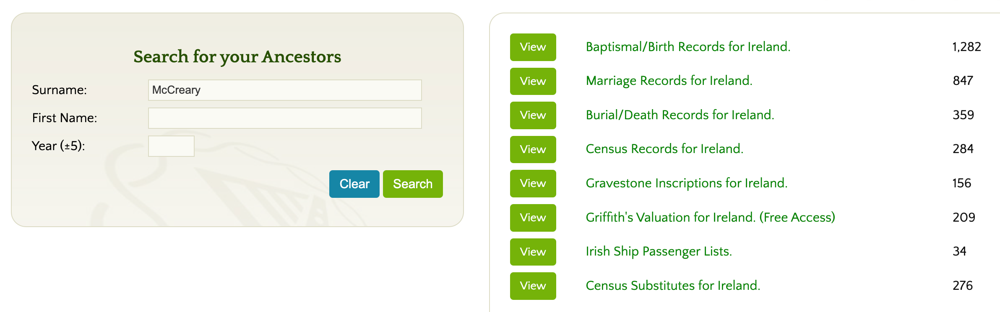

# Family History and Genealogy

Are you curious about finding more about McCreary family history? Although there are many online resources that help you find your ancestors in the United States going back three or four generations, there are VERY few records of our McCreary ancestors in Ireland and Scotland before 1800. When you reach a certain point there is just no information available. This is known as hitting the "brick walls" of genealogy.

However, there are some ways you can break through a few more layers. This chapter will guide you through the challenges, resources, and strategies for researching McCreary family history.

## Why McCreary Genealogy is Challenging

Researching the McCreary family presents unique challenges that make tracing ancestors back to Scotland and Ireland particularly difficult. Understanding these obstacles will help you set realistic expectations and develop better research strategies.

### The Record Gap Problem

The biggest challenge facing McCreary genealogists is what researchers call "the record gap"—the near-complete absence of accessible records from Scotland and Ireland before 1800. While American records can often take you back to the mid-1700s, the trail typically goes cold when you try to trace the family across the Atlantic.

**Why the Gap Exists:**

- **Limited Record Keeping**: Before the 1800s, most births, marriages, and deaths in Scotland and Ireland were recorded only by churches, not civil authorities. Many [Presbyterian](../../glossary.md#presbyterian) records from [Ulster](../../glossary.md#ulster) were not systematically preserved.

- **Church vs. State Records**: The [Kirk](../../glossary.md#presbyterian) (Presbyterian Church of Scotland) kept records, but not all have survived. In Ireland, Presbyterian records were less consistently maintained than [Anglican](../../glossary.md#anglican) or [Catholic](../../glossary.md#catholic) records because Presbyterians faced discrimination.

- **Emigration Documentation**: When McCreary families left Ulster for America in the 1700s, there were no comprehensive passenger lists. Unlike later immigration (1800s+), early emigrants left little paper trail of their departure or arrival.

*Suggested image: Timeline diagram showing "Record Availability by Time Period" - showing abundant records 1850-present, sparse records 1750-1850, and very few records pre-1750*

### Records Lost to Fire and Disaster

Many irreplaceable genealogical records were destroyed in fires and other disasters, creating permanent gaps in the historical record.

**Major Record Losses:**

- **Irish Public Record Office Fire (1922)**: The Four Courts building in Dublin, which housed Ireland's Public Record Office, was destroyed during the Irish Civil War. The fire destroyed:
  - Census records from 1821, 1831, 1841, and 1851
  - Many parish registers
  - Wills and probate records
  - Property and land records
  - Government documents

- **Church Fires**: Individual church buildings burned over the centuries, destroying baptism, marriage, and burial records. Presbyterian churches in Ulster were particularly vulnerable because they were sometimes targets during sectarian conflicts.

- **Family Records**: Many families lost personal records (Bibles, letters, documents) in house fires, floods, or simply through neglect over generations.

**What This Means for Researchers:**

Even if your ancestors lived in a specific townland in Ulster, records of their births, marriages, or land holdings may simply not exist anymore. This isn't a failure of research—the records are gone.

*Suggested image: Historical photo of the Four Courts fire in Dublin, 1922, with caption explaining the magnitude of loss*

### The Paywall Problem

Many surviving Irish records are locked behind expensive subscription services, creating a financial barrier to genealogical research.

**Cost Barriers:**

- **[Roots Ireland](https://rootsireland.ie/)**: The most comprehensive Irish genealogy database charges approximately $18 USD per day or $70 for a week of access. For serious research requiring multiple sessions, costs add up quickly.

- **Other Subscription Services**: Ancestry.com, Findmypast.ie, and other genealogy sites require monthly or annual subscriptions, often $20-30 per month.

- **Record Copies**: Ordering official copies of certificates from Irish or Scottish authorities can cost $10-20 per document.

**Free vs. Paid Resources:**

| Resource | Cost | Coverage | Notes |
|----------|------|----------|-------|
| Roots Ireland | ~$18/day | Most comprehensive Irish records | Includes parish registers, civil records |
| FamilySearch.org | Free | Good US records, some Irish | Run by LDS Church, volunteers index records |
| Griffith's Valuation | Free on Roots Ireland | Irish land surveys 1847-1864 | Property records, shows heads of household |
| ScotlandsPeople | Pay per view | Scottish civil records | £7-15 per search credit |
| National Archives Ireland | Free to visit | Original documents | Must travel to Dublin |
| PRONI (Belfast) | Free to visit | Ulster records | Must travel to Belfast |

*Suggested image: Screenshot showing the record count for "McCreary" and variants on Roots Ireland (approximately 3,000 records)*

*This image shows that RootsIreland has about 3,000 records related to the McCreary and related names, but they are behind a paywall*

### Griffith's Valuation: A Free Resource Worth Knowing

One valuable free resource on Roots Ireland is **Griffith's Valuation**, a comprehensive property survey conducted in Ireland between 1847 and 1864.

**What Griffith's Valuation Provides:**

- Lists the head of every household
- Shows property holdings and land valuations
- Indicates landlords and tenants
- Covers all of Ireland, including Ulster counties where McCrearys lived

**Limitations:**

- Only covers 1847-1864 (mid-1800s)
- Too late to trace families who emigrated in the 1700s
- Shows only property holders (not younger family members)
- Doesn't include births, marriages, or deaths

**How to Use It:**

Griffith's Valuation is most useful for:

1. Locating McCreary families still in Ireland in the 1850s-1860s
2. Identifying specific townlands where the family lived
3. Understanding property relationships and wealth
4. Finding family members who didn't emigrate

You can search Griffith's Valuation free at: [askaboutireland.ie/griffith-valuation](http://www.askaboutireland.ie/griffith-valuation/)

### Name Variations Complicate Searches

The McCreary surname has numerous spelling variations, making systematic searches difficult. You must search under multiple spellings to find all relevant records.

**Common Variations:**

- McCreary
- McCrary
- MacCreary
- MacCrary
- McCreery
- McCrory
- MacRory
- Magrory
- MacRuairidh (original [Gaelic](../../glossary.md#gaelic) form)

**Why So Many Spellings?**

- **Phonetic Spelling**: Before standardized spelling, clerks wrote names as they sounded. Irish and Scottish accents led to different interpretations.
- **Anglicization**: The Gaelic "Mac Ruaidhri" was anglicized in different ways.
- **Literacy Variations**: Family members might spell their own name differently at different times.
- **Clerical Errors**: Church and government clerks made mistakes or chose different spellings.

**Research Strategy:**

When searching databases, you must search ALL common variations. Most genealogy databases have "soundex" or "variants" options that help, but not all variations are caught automatically.

## Understanding McCreary Origins

Before diving into specific genealogical research, it helps to understand the broader context of McCreary family origins and migration patterns.

### The Name's Meaning

The surname McCreary derives from the [Gaelic](../../glossary.md#gaelic) **Mac Ruaidhri**, meaning "son of [Ruaidhri](../../glossary.md#ruaidhri)" (anglicized as Rory). The name literally means "son of the red king"—"ruadh" means red (likely referring to red hair) and "rí" means king.

This patronymic naming pattern was common in Gaelic Scotland and Ireland, where surnames indicated descent from a particular ancestor named Ruaidhri who likely lived many generations before surnames became fixed.

*Suggested diagram: Etymology flowchart showing: Mac Ruaidhri → MacRory/McCrory → McCreary/McCrary, with translations*

### Geographic Origins

McCreary families trace back to two primary geographic areas:

**Scotland (pre-1600s):**

- Predominantly [Lowland](../../glossary.md#lowlanders) Scottish families
- Western Scotland (Ayrshire, Galloway, Dumfriesshire regions)
- [Presbyterian](../../glossary.md#presbyterian) religion after the [Scottish Reformation](../../glossary.md#scottish-reformation) (1560)
- Part of the [clan system](../../glossary.md#clan-system) social structure

**Ulster, Ireland (1600s-1700s):**

- Families moved during the [Ulster Plantation](../../glossary.md#ulster-plantation) (1609+)
- Settled primarily in counties [Antrim](../../glossary.md#antrim), [Down](../../glossary.md#down), [Donegal](../../glossary.md#donegal), and [Tyrone](../../glossary.md#tyrone)
- Maintained Presbyterian identity
- Faced "double discrimination" from Catholics and Anglicans

**America (1700s onward):**

- First documented arrivals around 1718
- Initial settlement in [Pennsylvania](../../glossary.md#pennsylvania) ([Philadelphia](../../glossary.md#philadelphia), [Cumberland Valley](../../glossary.md#cumberland-valley))
- Migration south along the [Great Wagon Road](../../glossary.md#great-wagon-road)
- Settlement in [Virginia](../../glossary.md#shenandoah-valley), [Carolinas](../../glossary.md#carolinas), [Tennessee](../../glossary.md#tennessee), and [Kentucky](../../glossary.md#kentucky)

*Suggested map: Migration map showing arrows from Scotland → Ulster → Pennsylvania → Southern states*

### The "Scotch-Irish" Identity

McCreary families are part of the [Scotch-Irish](../../glossary.md#scotch-irish) (or Ulster Scots) ethnic group. Understanding this identity is crucial for genealogical research because it explains:

- **Why records are in both Scotland and Ireland**: Families lived in both places at different times
- **Religious affiliation**: Almost exclusively Presbyterian
- **Migration patterns**: Followed specific routes and settled specific regions
- **Community networks**: Scotch-Irish families tended to migrate and settle together

The Scotch-Irish were:

- Scottish by ethnicity and culture
- Irish by residence (1600s-1700s)
- American by destination (1700s-1800s)
- Presbyterian by religion
- Frontier settlers by choice

## Major Family Branches

McCreary families in America descend from multiple immigrant ancestors who arrived separately, creating distinct family branches. These branches are NOT necessarily closely related—they may descend from different families in Scotland/Ulster who happened to share the same surname.

### Known Early American Ancestors

Research has identified several early McCreary immigrants to America, though the connections between them remain unclear:

**George McCreary (c. 1752-1842)**

- One of the best-documented early McCrearys
- Settled in Pennsylvania
- Extensive descendants tracked in Marian Brune McCreary's genealogy book
- Multiple generations documented in American records

**Amos McCreary**

- Bedford County, Pennsylvania
- Subject of Fred D. Ickes's 1985 genealogy book
- Large extended family in Pennsylvania and westward
- Separate lineage from George McCreary (probably)

**Pennsylvania McCrearys (1720s-1740s)**

- Multiple McCreary families appear in Pennsylvania colonial records
- Some settled Cumberland Valley
- Others moved to Shenandoah Valley, Virginia
- Relationships between these families unclear

**Virginia and Carolina Lines**

- McCreary families appear in Virginia by 1760s
- North and South Carolina records show McCrearys by 1770s
- May include both new immigrants and descendants of Pennsylvania families

### The Challenge of Connecting Branches

One of the most frustrating aspects of McCreary genealogy is the difficulty of connecting family branches that existed before 1800.

**Why Connections Are Hard to Establish:**

- Lack of records from Ulster showing family relationships
- Multiple unrelated families with the same surname
- Incomplete American colonial records
- Families moved frequently, leaving gaps in documentation
- DNA testing can show genetic relationships but can't identify specific connecting ancestors

**What This Means for Your Research:**

If you can trace your ancestry back to a specific early American McCreary (like George or Amos), you can often document that line quite well. However, connecting your line to other McCreary branches, or tracing ancestors back to specific families in Ulster or Scotland, may be impossible with available records.

*Suggested diagram: Family tree diagram showing multiple root ancestors (George, Amos, Unknown 1, Unknown 2) with question marks showing uncertain connections back to Ulster/Scotland*

## Genealogical Research Strategies

Despite the challenges, there are effective strategies for researching McCreary family history. Here's how to approach your research systematically.

### Start with What You Know

The cardinal rule of genealogy: **Work backward from the present, one generation at a time.**

**Step 1: Document Your Immediate Family**

- Write down everything you know about your parents, grandparents, great-grandparents
- Record full names (including maiden names), birth dates, death dates, marriage dates
- Note locations (cities, counties, states)
- Gather documents: birth certificates, death certificates, marriage licenses, obituaries

**Step 2: Interview Living Relatives**

- Talk to older family members while you can
- Record family stories, even if they seem like legends
- Ask about family Bibles, photo albums, letters, documents
- Ask about family migration stories: where did ancestors come from?

**Step 3: Build Forward**

Once you have a solid foundation, work backward generation by generation, documenting each link with sources.

### Use Free Resources First

Before paying for subscriptions, exhaust free resources:

**FamilySearch.org**

- Free genealogy database run by the LDS Church
- Extensive American records (census, vital records, church records)
- Growing collection of Irish and Scottish records
- User-submitted family trees (use with caution—verify everything)
- Free access at Family History Centers worldwide

**National Archives Resources**

- US Census records (1790-1950) available free through various sites
- Revolutionary War records
- Immigration records (1800s onward)
- Land records and military records

**County and State Archives**

- Many counties digitize old records
- Wills, deeds, court records
- Local history collections
- Often free but may require visiting or emailing

**Presbyterian Church Records**

- Local Presbyterian churches where ancestors lived
- Baptism, marriage, and membership records
- Some digitized, others require visits
- Presbyterian Historical Society has centralized collections

### Using Paid Databases Effectively

If you decide to pay for access, use your subscription time efficiently:

**Before Subscribing:**

1. Make a list of specific ancestors you need to research
2. Note specific time periods and locations
3. Prepare to download and save everything you find
4. Consider shared subscriptions with other family researchers

**Maximize Your Research Time:**

- Use the free trial period strategically
- Research multiple family lines simultaneously
- Download all records and images immediately
- Take detailed notes with source citations
- Consider paying for one month when you have dedicated research time

**Best Paid Resources for McCreary Research:**

- **Ancestry.com**: Best for American records, some Irish records
- **Findmypast.ie**: Strong Irish and British records
- **ScotlandsPeople**: Official Scottish records
- **Roots Ireland**: Most comprehensive Irish parish registers

### DNA Testing for Genealogy

DNA testing has revolutionized genealogy, offering ways to break through brick walls when paper records run out.

**Types of DNA Tests:**

| Test Type | What It Shows | Best For | Cost Range |
|-----------|---------------|----------|------------|
| Autosomal | Matches all lines, 5-7 generations | Finding living cousins, recent ancestry | $50-100 |
| Y-DNA | Direct paternal line (father to father) | McCreary surname line, deep paternal ancestry | $100-300 |
| mtDNA | Direct maternal line (mother to mother) | Deep maternal ancestry | $150-300 |

**Autosomal DNA (Most Popular):**

- Tests your entire genetic makeup
- Finds cousins on all family lines
- Shows ethnic breakdown
- Most useful for genealogy research
- Offered by AncestryDNA, 23andMe, MyHeritage, FamilyTreeDNA

**How DNA Helps McCreary Research:**

1. **Find Living Cousins**: Connect with other McCreary descendants researching the same lines
2. **Confirm Relationships**: Verify suspected family connections
3. **Break Brick Walls**: Find common ancestors through shared DNA matches
4. **Identify Origin Regions**: See where your ancestors came from (Scotland vs. Ireland percentages)

**Limitations:**

- DNA shows you're related but doesn't tell you HOW you're related
- You still need paper records to identify specific ancestors
- Requires time to contact matches and compare family trees
- Not everyone who tests shares their information or responds to messages

**Research Strategy:**

1. Take an autosomal DNA test from a major company
2. Build a detailed family tree on that platform
3. Review your DNA matches regularly
4. Contact close matches who might research the same McCreary lines
5. Join McCreary DNA projects on FamilyTreeDNA

### Understanding Source Citation

As you research, maintain careful records of your sources. This is crucial because:

- You'll need to verify conflicting information
- Other researchers will want to check your work
- You'll forget where you found information
- Good documentation makes your research valuable to others

**What to Record:**

For every fact, record:

- Where you found it (website, book, archive)
- Specific citation (database name, collection, document ID)
- Date you accessed it
- Direct quote or image of the record
- Your assessment of reliability

**Source Reliability Hierarchy:**

1. **Primary Sources** (created at the time): Birth certificates, church registers, contemporary letters
2. **Secondary Sources** (created later): Death certificates (for birth date), census records, obituaries
3. **Tertiary Sources** (compiled): Published genealogies, family trees, family stories

Always prefer primary sources when available. Verify secondary and tertiary sources with primary documents when possible.

## Resources for McCreary Family History Genealogical Research

### Online Databases

**Free Resources:**

- [FamilySearch.org](https://www.familysearch.org) - Free, extensive records, user-submitted trees
- [Griffith's Valuation](http://www.askaboutireland.ie/griffith-valuation/) - Irish property records 1847-1864
- [FreeBMD](https://www.freebmd.org.uk/) - Free British births, marriages, deaths index
- [ScotlandsPeople](https://www.scotlandspeople.gov.uk/) - Pay-per-view Scottish records (some free indexes)
- US Census records - Available through multiple free and paid sites

**Paid Resources:**

- [Ancestry.com](https://www.ancestry.com) - $25-50/month - Best overall US records, growing international collection
- [Roots Ireland](https://rootsireland.ie/) - ~$18/day - Most comprehensive Irish parish records and civil records
- [Findmypast.ie](https://www.findmypast.ie/) - $15-20/month - Strong Irish and British records
- [ScotlandsPeople](https://www.scotlandspeople.gov.uk/) - Pay per credits - Official Scottish government records

### Books

*I am somewhat reluctant to recommend these books. Some of them only cover a very narrow branch of our family tree. Many do not provide the high-quality interactive timelines and maps that we do in this website. However, they may be valuable if your line connects to one of these specific families.*

**Published Genealogies:**

1. [McCreary Family Tree](http://mccrearyfamilytree.com/introduction.html) - 2015 - Marian Brune McCreary
   - Focuses exclusively on descendants of George McCreary (1752-1842)
   - [Chapter 1](http://mccrearyfamilytree.com/chapter-1.html) is available free
   - Full book costs $80.00
   - Very detailed for this specific line
   - Good source if you descend from George McCreary

2. [McCreary Genealogy: Descendants Of Amos McCreary Of Bedford County, Pennsylvania](https://www.amazon.com/McCreary-Genealogy-Descendants-Bedford-Pennsylvania/dp/B001D3LTQW) - 1985 - Fred D. Ickes
   - Paperback, approximately $65.00
   - Covers Amos McCreary line in Pennsylvania
   - Out of print, may be available in libraries
   - Separate from George McCreary line

**General Scotch-Irish Resources:**

3. [Born Fighting: How the Scots-Irish Shaped America](https://www.amazon.com/Born-Fighting-Scots-Irish-Shaped-America/dp/0767916891) - James Webb
   - Not genealogy, but excellent cultural and historical context
   - Explains Scotch-Irish migration patterns and settlements
   - Helps understand why McCrearys settled where they did

4. [The Scotch-Irish: A Social History](https://www.amazon.com/Scotch-Irish-Social-History-James-Leyburn/dp/0807842591) - James G. Leyburn
   - Academic but readable history
   - Covers Ulster Plantation through American settlement
   - Essential background for understanding McCreary family context

### Archives and Libraries

**In-Person Research (Worth the Trip):**

**For Irish Records:**

- **PRONI (Public Record Office of Northern Ireland)** - Belfast
  - Free access
  - Ulster records including Presbyterian church registers
  - Must visit in person or hire a researcher
  - Website: [proni.gov.uk](https://www.nidirect.gov.uk/proni)

- **National Archives of Ireland** - Dublin
  - Free access
  - Griffith's Valuation, census substitutes, land records
  - Website: [nationalarchives.ie](https://www.nationalarchives.ie/)

**For Scottish Records:**

- **National Records of Scotland** - Edinburgh
  - Pay-per-view access also available online
  - Old parish registers, civil records, census
  - Website: [nrscotland.gov.uk](https://www.nrscotland.gov.uk/)

**For American Records:**

- **Presbyterian Historical Society** - Philadelphia, PA
  - Centralized Presbyterian church records
  - Records from churches where McCrearys worshipped
  - Website: [history.pcusa.org](https://www.history.pcusa.org/collections)

- **State and County Archives**
  - Pennsylvania State Archives - Harrisburg, PA
  - Virginia State Library - Richmond, VA
  - Kentucky Historical Society - Frankfort, KY
  - Tennessee State Library - Nashville, TN
  - North Carolina State Archives - Raleigh, NC
  - South Carolina Department of Archives - Columbia, SC

**Family History Centers:**

- Over 5,000 locations worldwide
- Free access to FamilySearch resources
- Microfilm readers for archived records
- Volunteers can help with research
- Find locations: [familysearch.org/locations](https://www.familysearch.org/en/help/helpcenter/article/how-do-i-find-a-family-history-center)

### DNA Resources

**Testing Companies:**

- [AncestryDNA](https://www.ancestry.com/dna/) - $99 (often on sale) - Largest database, integrated with Ancestry trees
- [23andMe](https://www.23andme.com/) - $99-199 - Health reports plus ancestry
- [MyHeritage DNA](https://www.myheritage.com/dna) - $79 - Strong international database
- [FamilyTreeDNA](https://www.familytreedna.com/) - $79-300 - Y-DNA and mtDNA available, DNA projects

**DNA Projects:**

- Search for "McCreary DNA Project" on FamilyTreeDNA
- Join Scotch-Irish DNA groups on Facebook and other platforms
- Share results across multiple platforms (most allow uploads)

### Online Communities

**Facebook Groups:**

- "McCreary Family Genealogy" - Connect with other McCreary researchers
- "Scotch-Irish Genealogy" - Broader community for Ulster Scots research
- County-specific genealogy groups for where your ancestors lived

**Forums and Message Boards:**

- [Ancestry.com Message Boards](https://www.ancestry.com/boards/) - Search for McCreary surname discussions
- [RootsWeb Mailing Lists](https://lists.rootsweb.com/) - Email-based genealogy communities
- [FamilySearch Community](https://community.familysearch.org/) - Questions and research help

### Hiring Professional Researchers

If you've exhausted your own research abilities, consider hiring a professional genealogist:

**When to Hire a Professional:**

- You've hit a specific brick wall and tried everything
- You need records from archives you can't visit
- You need help reading old handwriting or foreign languages
- You want someone experienced in Irish/Scottish research

**How to Find Genealogists:**

- [Association of Professional Genealogists](https://www.apgen.org/) - Directory of certified researchers
- [Board for Certification of Genealogists](https://bcgcertification.org/) - Highest standard of certification
- Look for specialists in Irish and Scottish research
- Expect to pay $30-100+ per hour depending on expertise

**What to Expect:**

- Most researchers charge by the hour
- They provide detailed reports with source citations
- They can't guarantee they'll find your ancestors
- You pay for research time, not results
- Get a written agreement on scope and costs

## Tips for Success

### Realistic Expectations

**What's Achievable:**

- Tracing your line back 3-5 generations in America (1800s-1900s)
- Finding your immigrant ancestor (possibly to 1700s)
- Identifying the general region in Ulster where your family lived
- Connecting with living cousins through DNA

**What's Challenging/Impossible:**

- Tracing specific ancestors back to Scotland (pre-1600s)
- Connecting your line to other McCreary branches without records
- Finding comprehensive family records in Ulster before 1800
- Identifying exact townlands in Scotland where ancestors originated

### Avoid Common Pitfalls

**Don't:**

- Assume all McCrearys are related - many separate families share the surname
- Trust online family trees without verifying sources
- Skip generations - document each link
- Give up when you hit a brick wall - try different approaches
- Pay for records you can access free elsewhere

**Do:**

- Document every source carefully
- Verify information with multiple records
- Connect with other researchers
- Be patient - genealogy takes time
- Focus on what's achievable with available records

### Building on This Website

This website provides context that makes your genealogical research more meaningful:

- **Timeline**: See what was happening when your ancestors lived
- **Geography**: Understand where your ancestors lived and why they moved
- **Culture**: Learn about Scotch-Irish traditions your family maintained
- **History**: Understand the events that shaped family decisions

Use this site to understand the "why" behind the "who, what, when, where" you discover in genealogical records.

## Conclusion

McCreary family genealogy is challenging but rewarding. While you may never trace your line all the way back to medieval Scotland, you can build a meaningful family history that connects your living relatives to the broader Scotch-Irish experience.

The key is to:

- Start with what you know and work backward carefully
- Use free resources before paying for subscriptions
- Document your sources meticulously
- Connect with other researchers
- Accept that some brick walls can't be broken
- Focus on telling the story of the ancestors you CAN document

Remember: genealogy isn't just about names and dates. It's about understanding who your ancestors were, what they experienced, and how their choices shaped your family's path through history. Even when records run out, you can still tell the larger story of the Scotch-Irish migration from Scotland through Ulster to America—a story your McCreary ancestors were part of.

## References

1. [Family Search Born: Ireland and UK, Died: US](https://www.familysearch.org/en/search/all-collections/results?searchType=tree&page=0&size=20&q.surname=McCreary&c.birthLikePlace1=on&f.birthLikePlace0=9&c.deathLikePlace1=on&f.deathLikePlace0=10) - shows 494 results

1. [Public Record Office of Northern Ireland (PRONI)](https://www.nidirect.gov.uk/proni) - Official repository for Ulster records including Presbyterian church registers

2. [National Records of Scotland](https://www.nrscotland.gov.uk/) - Official source for Scottish genealogical records including Old Parish Registers

3. [Irish Genealogy: A Guide to Tracing Your Irish Ancestors](https://www.irishgenealogy.ie/) - Government of Ireland's official genealogy portal

4. [Presbyterian Historical Society](https://www.history.pcusa.org/) - Central repository for American Presbyterian church records

5. [The Four Courts Fire and Its Impact on Irish Genealogy](https://www.ireland.com/en-us/articles/genealogy/irish-records-destroyed/) - Understanding the 1922 record loss

6. [FamilySearch Research Wiki: Ireland](https://www.familysearch.org/en/wiki/Ireland_Genealogy) - Comprehensive guide to Irish genealogical research

7. [Scotch-Irish Genealogy Research Guide](https://www.familysearch.org/en/wiki/Scots-Irish_in_the_United_States) - Specific strategies for Scotch-Irish research

8. [Association of Professional Genealogists: Hiring a Researcher](https://www.apgen.org/hire/) - Guide to working with professional genealogists
