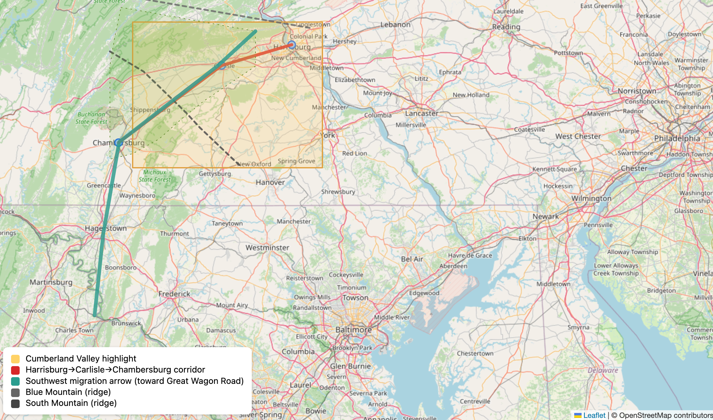

# The Pennsylvania Branch: Foundation of the American McCreary Family

## Introduction

The Pennsylvania branch of the McCreary family represents the foundational American settlement of this Scotch-Irish lineage. Beginning in the early 18th century, McCreary families departing from Ulster ports arrived in the Delaware Valley and established themselves in what would become one of the most significant concentrations of Scotch-Irish culture in colonial America. This branch would serve as the wellspring from which subsequent generations would spread throughout the Appalachian frontier and beyond, carrying with them the distinctive cultural, religious, and social traditions that had been forged in Scotland and tempered in Ulster.

## The Great Migration Context

### Push Factors from Ulster

The McCreary families who arrived in Pennsylvania during the 18th century were part of a larger exodus driven by multiple intersecting pressures in Ulster:

**Economic Pressures:**

- **Lease Expirations**: Plantation-era leases (granted for 31 years) expired in the early 1700s
- **Rent Increases**: Dramatic rent hikes from English and Anglo-Irish landlords
- **Agricultural Crises**: Severe droughts in 1714-1719 and 1728-1729 devastated crops and livestock
- **Limited Economic Opportunities**: Restricted trade and manufacturing under English mercantile laws

**Religious Discrimination:**

Despite their Protestantism, Ulster Presbyterians faced legal restrictions that added urgency to economic distress:

- **Test Acts Requirements**: Conformity to Anglican Church required for public office
- **Unrecognized Marriages**: Presbyterian marriages not legally valid
- **School Restrictions**: Presbyterian schools operated under limitations
- **Invalid Ceremonies**: Presbyterian ministers couldn't perform legally binding ceremonies
- **"Double Discrimination"**: Caught between Catholic Irish below and Anglican English above

<!-- Suggested Image: Period illustration of Ulster families preparing to depart, showing packed belongings and emotional farewells -->

### Pull Factors to Pennsylvania

Pennsylvania offered several powerful attractions to Ulster emigrants:

**Religious Freedom:**

- William Penn's "holy experiment" promised genuine religious tolerance
- Presbyterians could worship freely without Anglican conformity
- Establish own churches and participate fully in civic life
- No religious discrimination for holding office

**Economic Opportunities:**

- Fertile lands available at reasonable prices
- Ownership possibilities unavailable in Ulster
- Growing markets for agricultural products
- No restrictive trade laws limiting commerce

**Political Rights:**

- Representative government with actual participation
- Political rights that seemed extraordinary to excluded Ulster Presbyterians
- Legal equality regardless of religious denomination

**Established Networks:**

- Regular shipping routes between Ulster ports and Philadelphia
- Ships carried flaxseed to Ulster, returned with emigrants
- Letters from earlier emigrants described opportunities
- Presbyterian congregational networks helped newcomers
- Family connections provided information and assistance

<!-- Suggested Map: Migration routes from Ulster ports (Belfast, Londonderry) to Philadelphia and New Castle, Delaware, showing Atlantic crossing -->

## Initial Settlement Patterns

### Philadelphia and the Delaware Valley

Most McCreary families arrived through **Philadelphia** (primary port) or **New Castle, Delaware** (secondary port).

<!-- Suggested Image: Philadelphia harbor circa 1720s-1750s showing ships, docks, and arriving immigrants -->

**Philadelphia as Gateway (Not Destination):**

Philadelphia in the early 18th century was the largest city in the colonies, but most Scotch-Irish immigrants didn't stay:

- Prime lands near Philadelphia already claimed
- Quaker establishment viewed Scotch-Irish with apprehension
- Seen as prone to violence and religious enthusiasm
- Land prices too high for typical immigrant families

**Typical Arrival Pattern:**

1. Brief stay in Philadelphia or immediate vicinity (days to weeks)
2. Purchase supplies and equipment for frontier life
3. Make contacts with earlier Ulster emigrants
4. Gather information about available lands
5. Connect with Presbyterian congregation networks
6. Receive orientation and settlement location recommendations
7. Depart for interior settlements

### The Cumberland Valley

The Cumberland Valley, stretching southwest from Harrisburg through Carlisle to Chambersburg and beyond, became the first major concentration of McCreary settlement in Pennsylvania. This fertile valley, bounded by the Appalachian ridges, offered excellent agricultural land at affordable prices. The valley's orientation southwest along the Appalachian chain created a natural corridor that would eventually become the famous Great Wagon Road, channeling migration from Pennsylvania into the southern backcountry.

McCreary families established farms in the Cumberland Valley beginning in the 1720s and continuing through the mid-18th century. They created dispersed settlement patterns rather than nucleated villages, with families claiming land, clearing forests, and establishing individual farmsteads connected by rough roads and paths. The typical farm ranged from 100 to 300 acres, though some families acquired larger holdings over time.

### Other Pennsylvania Settlement Areas

Beyond the Cumberland Valley, McCreary families settled in several other regions of Pennsylvania that attracted Scotch-Irish emigrants:

<!-- Suggested Map: Pennsylvania settlement patterns showing Cumberland Valley, Lancaster, York, and Juniata regions with concentration indicators -->

| Settlement Region | Established | Characteristics | McCreary Settlement Pattern |
|-------------------|-------------|-----------------|----------------------------|
| **Cumberland Valley** | 1720s-1750s | Fertile valley, affordable land, first major concentration | Primary settlement area, largest concentration |
| **Lancaster County** | 1730s-1760s | Mix of German and Scots-Irish, good farmland | Some settlement, cultural exchange with Germans |
| **York County** | 1749+ | Frontier position, affordable prices | Secondary concentration, grain and livestock economy |
| **Juniata River Valley** | 1760s-1780s | Remote, heavily forested, larger holdings available | Later wave settlement, frontier hardships |

**Lancaster County:**

- More heavily German than Scots-Irish
- Cultural exchanges with Pennsylvania German neighbors
- Intermarriage occurred while maintaining Presbyterian identity
- Good agricultural land

**York County:**

- Established in 1749 as frontier county
- Affordable land prices attracted families
- Typical frontier economy: grain and livestock
- Growing Scotch-Irish concentration

**Juniata River Valley:**

- Later settlement period (1760s-1780s)
- Heavily forested and remote
- Larger land holdings available
- Required willingness to endure frontier hardships
- Became Mifflin, Huntingdon, and Juniata counties

## Economic Life

### Agricultural Practices

The McCreary families in Pennsylvania quickly adapted their agricultural practices to New World conditions while maintaining some Ulster patterns.

<!-- Suggested Image: Typical Scotch-Irish log cabin/farmstead showing cleared fields, outbuildings, and family at work -->

**Primary Crops:**

- **Wheat**: Foundation of Pennsylvania economy, surplus shipped to Atlantic markets
- **Rye**: Hardy grain for bread and animal feed
- **Corn**: New World crop quickly adopted for versatility
- **Oats**: Traditional Scottish/Irish grain for porridge and livestock

**Diversified Agriculture (Unlike Ulster's intensive flax cultivation):**

- **Kitchen Gardens**: Vegetables for family subsistence
- **Orchards**: Apples and other fruits for eating, cider, and sale
- **Livestock**: Cattle, pigs, sheep, and horses for food, labor, and market
- **Mixed Strategy**: Provided both subsistence and market goods

<!-- Suggested Table: Typical Farm Production -->

| Crop/Product | Primary Use | Market Value | Season |
|--------------|-------------|--------------|--------|
| Wheat | Bread flour, export to cities | High | Summer harvest |
| Corn | Food, animal feed, whiskey | Medium | Fall harvest |
| Rye | Bread, animal feed | Medium | Summer harvest |
| Oats | Porridge, animal feed | Low-Medium | Summer harvest |
| Cattle | Meat, dairy, leather | High | Year-round |
| Pigs | Meat (salted/smoked) | Medium | Fall butchering |
| Apples | Fresh, cider, dried | Medium | Fall harvest |
| Whiskey | Beverage, currency | High | Year-round |

**Whiskey Production - A Characteristic Enterprise:**

Whiskey production became emblematic of Scotch-Irish frontier economy:

- **Traditional Knowledge**: Distilling skills from Scotland and Ireland
- **Surplus Grain**: Converted excess grain into valuable product
- **Liquid Currency**: Easier to transport than grain, commanded good prices
- **Multiple Uses**: Beverage, medicine, trade commodity, currency
- **Small-Scale Operations**: Many families operated small stills on farms
- **Future Conflict**: Later brought families into conflict with federal authorities during Whiskey Rebellion (1794)

<!-- Suggested Infographic: Whiskey production process from grain to barrel -->

### Land Acquisition and Management

Land acquisition patterns reveal the ambitions and challenges of McCreary families in Pennsylvania.

**Typical Land Holdings:**

- **Initial Purchases**: Often modest, 50-200 acres
- **Expansion Strategy**: Families aimed to grow holdings over time
- **Generational Planning**: Purchase land for adult sons to establish nearby
- **Goal**: Maintain extended family networks and mutual support

**Penn Family Land Policies:**

Two main pathways to land ownership:

1. **Direct Purchase**:
   - Clear title from Penn family or proprietors
   - Higher initial cost but secure ownership
   - Preferred by families with capital

2. **Warrant Lands**:
   - Settlers could occupy and improve land before completing purchase
   - Lower initial cost, payment over time
   - Risk of disputes over boundaries and titles
   - Some McCreary families used this system

**Challenges and Complexities:**

- **Boundary Disputes**: Unclear property lines led to conflicts
- **Title Questions**: Uncertain ownership created legal challenges
- **Post-Revolutionary Transition**: Shift from colonial to state/private ownership
- **Mixed Outcomes**: Some families navigated successfully, others lost disputed lands

<!-- Suggested Table: Sample McCreary Land Purchases with dates, locations, acreage, and prices -->

### Frontier Commerce

While primarily agricultural, the Pennsylvania frontier economy included various commercial activities in which McCreary families participated.

**Community Enterprises:**

- **Grist Mills**: Essential for grinding grain into flour
  - Some families established mills serving their neighborhoods
  - Provided community service and income
  - Often located on streams for water power

- **Blacksmith Shops**: Critical for tool repair and horseshoeing
  - Needed services for farming communities
  - Supplemental income for farming families

- **Tanneries**: Leather production for shoes, harnesses, and goods
  - Processing animal hides
  - Local manufacturing

- **Other Artisan Enterprises**: Carpentry, coopering (barrel-making), weaving

**The Great Wagon Road - Major Commercial Artery:**

The Great Wagon Road developed through the Cumberland Valley and transformed frontier commerce:

<!-- Suggested Map: The Great Wagon Road route from Philadelphia through Cumberland Valley to southern backcountry -->

- **Freighting Business**: Some McCreary families engaged in goods transport
- **Large Wagons**: Pulled by teams of 4-6 horses
- **Two-Way Trade**:
  - **Outbound**: Frontier agricultural products to Philadelphia markets
  - **Inbound**: Manufactured goods and luxuries to backcountry settlements
- **Economic Connection**: Linked frontier communities to Atlantic world markets
- **Cultural Exchange**: Brought news, ideas, and goods from coastal cities

<!-- Suggested Image: Conestoga wagon with team of horses, showing typical freight load -->

## Religious and Cultural Life

### Presbyterian Congregations

The Presbyterian church stood at the center of Scotch-Irish community life in Pennsylvania. McCreary families were instrumental in founding and maintaining Presbyterian congregations throughout their settlement areas.

<!-- Suggested Image: Presbyterian meetinghouse exterior and interior views showing simple architecture and worship space -->

**Multiple Functions of Presbyterian Churches:**

- Religious services and worship
- Education for children and adults
- Social connection and community gatherings
- Community organization and governance
- Support networks during hardships

**Typical Congregational Development Pattern:**

1. **Informal Beginnings**: Worship meetings in homes or temporary structures
2. **Community Stabilization**: As settlements grew, organization improved
3. **Calling Ministers**: Often from Ulster or Scotland, maintaining cultural ties
4. **Meetinghouse Construction**: Permanent buildings for worship
5. **Elder Election**: Local leadership through elected elders
6. **Presbytery Formation**: Multiple congregations organized into regional networks

**Presbyterian Church Governance - Reinforcing Democratic Values:**

- **Elected Elders**: Congregation chose its own leaders
- **Representative System**: Elders represented congregation in presbytery
- **Collective Decision-Making**: Major decisions made by groups, not individuals
- **Political Influence**: These governance patterns shaped political attitudes about self-government and resistance to tyranny

**Presbyterian Worship Characteristics:**

- **Preaching**: Central focus on biblical exposition and instruction
- **Psalm Singing**: Congregational singing without instrumental accompaniment
- **Rigorous Theology**: Detailed doctrinal instruction (catechisms, confessions)
- **Minister's Multiple Roles**: Spiritual leader, educator, community intellectual

<!-- Suggested Diagram: Presbyterian church governance structure showing congregation → Session (elders) → Presbytery → Synod -->

**Network Connections:**

Presbyteries organized multiple congregations, creating networks that:

- Connected frontier settlements to each other
- Maintained ties to eastern Presbyterian bodies
- Preserved connections to Ulster and Scotland
- Facilitated information exchange and mutual support
- Provided circuit-riding ministers to isolated communities

### Education and Literacy

Presbyterianism's emphasis on biblical literacy and educated clergy created a strong educational culture among McCreary families and other Scotch-Irish settlers.

**Educational Values and Motivations:**

- **Religious Requirement**: Biblical literacy essential for Presbyterian faith
- **Cultural Priority**: Education valued even in harsh frontier conditions
- **Social Mobility**: Pathway to higher status and professional opportunities
- **Community Investment**: Families cooperated to establish schools

**Subscription Schools - Typical Frontier Education:**

The standard educational model on the frontier:

- **Funding**: Families paid ("subscribed") a teacher to instruct children
- **Curriculum**: Reading, writing, arithmetic, sometimes Latin and Greek
- **Primary Texts**: Bible, psalters, catechisms (embedding religious instruction)
- **Location**: Often in homes, churches, or simple schoolhouses
- **Seasonal**: School terms worked around agricultural demands

<!-- Suggested Image: Frontier schoolroom showing simple furnishings, students at work, teacher instructing -->

**Ministers as Educators:**

Ministers played crucial educational roles:

- Running schools themselves
- Identifying and training suitable instructors
- Providing advanced instruction in theology and classics
- Serving as community intellectuals and knowledge resources

**Educational Outcomes:**

- **High Literacy Rates**: Even in frontier areas, Scotch-Irish communities showed strong literacy
- **Gender Differences**: Boys more likely to receive extended education
- **Practical Skills**: Education combined academic and practical knowledge

**Advanced Education:**

Some families invested in higher education for promising sons:

| Institution | Location | Purpose | Typical Students |
|-------------|----------|---------|------------------|
| **Academies** | Philadelphia and other towns | College preparation, advanced studies | Sons of more prosperous families |
| **Princeton** | New Jersey | Ministry preparation, learned professions | Presbyterian students seeking professional careers |
| **Study with Ministers** | Local | Theological training, classical education | Aspiring ministers without funds for college |

**Social Impact:**

This investment in education reflected:

- Deep religious values about biblical knowledge
- Social ambition for family advancement
- Pathways to ministry, law, medicine, and teaching
- Community leadership development

### Cultural Preservation and Adaptation

In Pennsylvania, McCreary families maintained elements of their Scottish and Ulster heritage while adapting to American conditions.

**Language:**

- **Scots-Irish Dialect**: Continued in daily use with characteristic vocabulary, pronunciation, and expressions
- **Scots Gaelic**: Some families maintained knowledge, though declining
- **English**: Dominant language for communication and commerce
- **Distinctive Speech Patterns**: Marked Scotch-Irish identity into 19th century

<!-- Sidebar: "Scotch-Irish Words and Phrases Still Used Today" - Examples of dialect terms that survived -->

**Food Traditions - Continuity and Change:**

| Traditional (from Scotland/Ulster) | Adapted/New (in Pennsylvania) | Hybrid Practices |
|-----------------------------------|-------------------------------|------------------|
| Oatcakes and porridge | Corn bread and hominy | Mixing oats and corn |
| Sowans (fermented oat drink) | Apple cider | Using local fruits |
| Potato and cabbage preparations | Pumpkin and squash dishes | Vegetable stews combining old and new |
| Mutton and preserved meats | Venison and wild game | Preserved pork and beef |

**Work Patterns and Community Cooperation:**

Traditional seasonal rhythms adapted to frontier conditions:

- **Barn-Raising**: Community gathered to construct large buildings
- **Harvesting**: Neighbors helped each other bring in crops
- **Butchering**: Communal events for processing livestock
- **Quilting Bees**: Women gathered for textile work and socializing
- **Corn-Husking**: Social gathering combined with essential work

These cooperative work patterns:

- Reduced individual labor burden
- Strengthened community bonds
- Provided social opportunities in isolated settlements
- Maintained cultural traditions of mutual aid

**Celebrations and Social Gatherings:**

<!-- Suggested Image: Family gathering or community celebration scene showing people in period clothing -->

**Sacramental Occasions - Major Religious and Social Events:**

Multi-day communion services were centerpieces of Scotch-Irish social life:

- **Duration**: Typically Thursday through Monday
- **Religious Focus**: Preaching, communion, theological instruction
- **Social Opportunities**:
  - Dispersed families reunited
  - Courtship and matchmaking
  - Exchange of news and information
  - Trading and commerce
  - Political discussion

**Other Social Gatherings:**

- **Weddings**: Extended family celebrations with feasting
- **Funerals**: Community gatherings to support bereaved families
- **Market Days**: Commerce combined with social connection
- **Militia Musters**: Military training combined with socializing

## Family Structure and Social Organization

### Kinship Networks

The McCreary families in Pennsylvania maintained strong kinship bonds that shaped settlement patterns and social organization.

<!-- Suggested Diagram: Family tree example showing complex kinship connections through marriage and extended family -->

**Extended Family Networks:**

Networks included multiple layers of connection:

- **Nuclear Families**: Parents and children
- **Extended Kin**: Grandparents, aunts, uncles, cousins
- **In-Laws**: Marriage connections between families
- **Townland Connections**: Families from same Ulster communities
- **Clan Associations**: Broader Scottish clan identity

**Settlement Clustering:**

Kinship bonds shaped where families settled:

- Related families claimed neighboring lands
- Created mutual support networks in wilderness
- Maintained cultural and linguistic connections
- Provided security in dangerous frontier conditions
- Facilitated church and school establishment

**Kinship Networks as Mutual Aid Societies:**

Family networks provided essential support:

| Type of Aid | How Networks Functioned | Examples |
|-------------|------------------------|----------|
| **Agricultural Labor** | Shared work during peak seasons | Planting, harvesting, barn-raising |
| **Tools and Livestock** | Pooled expensive resources | Sharing plows, draft animals |
| **Housing** | Temporary shelter for new arrivals | Welcoming Ulster emigrants |
| **Community Building** | Cooperative establishment | Churches, schools, mills |
| **Crisis Support** | Aid during emergencies | Crop failure, illness, Indian attacks |
| **Information** | Knowledge about land, conditions | Settlement locations, opportunities |

**Marriage Patterns:**

Marriage reinforced and expanded kinship networks:

- **Endogamy**: McCrearys frequently married other Scotch-Irish families
- **Religious Compatibility**: Presbyterian identity crucial in partner selection
- **Economic Considerations**: Land holdings and family status mattered
- **Family and Church Networks**: Arranged through social connections
- **Ulster Regional Ties**: Often united families from same Irish counties
- **Complex Webs**: Created intricate relationship networks across settlements

<!-- Suggested Sidebar: "Voices from the Past: A Letter Describing Family Connections" -->

### Gender Roles and Women's Work

Women in McCreary families bore enormous responsibilities in frontier Pennsylvania.

<!-- Suggested Sidebar: "Women's Work: A Week in the Life" - Detailed description of daily and weekly tasks -->

**Household Production Responsibilities:**

Women managed complex household economies:

- **Food Preparation and Preservation**:
  - Cooking daily meals over open hearths
  - Preserving meat (smoking, salting)
  - Drying fruits and vegetables
  - Making cheese and butter
  - Baking bread
  - Brewing beer and cider

- **Textile Production**:
  - Spinning wool and flax into thread
  - Weaving cloth
  - Sewing clothing for entire family
  - Mending and repairing garments
  - Knitting stockings and mittens

- **Other Manufacturing**:
  - Soap making from animal fats
  - Candle making for lighting
  - Herbal medicine preparation
  - Dyeing cloth

- **Kitchen Gardens and Poultry**:
  - Growing vegetables
  - Tending herb gardens
  - Caring for chickens, geese, and ducks
  - Collecting eggs

**Agricultural Labor:**

During planting and harvest seasons, women worked in fields alongside men:

- Planting and weeding crops
- Harvesting grain and vegetables
- Processing flax and hemp
- Helping with haymaking

**Reproductive Role - Central to Family Survival:**

| Aspect | Typical Experience |
|--------|-------------------|
| **Family Size** | 6-10 children common for couples surviving childbearing years |
| **Childbirth Frequency** | Births every 18-24 months during fertile years |
| **Maternal Mortality** | Significant danger, constant threat to women's lives |
| **Infant Mortality** | High, many children died before age 5 |
| **Midwives** | Older, experienced women attended deliveries |
| **Healthcare Services** | Midwives provided crucial medical care beyond childbirth |

**Religious and Community Participation:**

Beyond household roles, women contributed significantly to community life:

**Church Membership:**
- Full members of Presbyterian churches
- Participated in worship services
- Subject to church discipline (same standards as men)
- Could not serve as elders or ministers (gender restrictions)

**Informal Support Networks:**

Women formed crucial mutual aid systems:

- Visiting sick neighbors
- Assisting with childbirths as midwives or helpers
- Preparing bodies for burial
- Providing emotional support during hardships
- Sharing knowledge about household arts
- Collective work (quilting bees, spinning gatherings)
- Information exchange about family news, health remedies, recipes

<!-- Suggested Table: Typical children's chores by age and gender showing how work was divided -->

### Child-Rearing and Socialization

Children in McCreary families entered the work force at young ages, with tasks assigned according to age and gender.

**Age-Graded Work Responsibilities:**

| Age Range | Boys' Tasks | Girls' Tasks |
|-----------|-------------|--------------|
| **3-6 years** | Gathering eggs, feeding chickens, simple errands | Caring for younger siblings, gathering eggs, helping mother |
| **7-10 years** | Feeding livestock, carrying water/wood, weeding gardens | Spinning, knitting, simple cooking, garden work |
| **11-14 years** | Plowing, planting, harvest work, learning trades | Weaving, sewing, food preservation, full household duties |
| **15+ years** | Full agricultural/trade work alongside father | Complete household management skills |

<!-- Suggested Sidebar: "A Day in the Life" of a frontier child showing typical daily routine -->

**Presbyterian Religious Culture and Discipline:**

**Moral and Religious Instruction:**
- Children taught catechisms from young ages
- Required attendance at church services (often hours long)
- Faced punishment for misbehavior
- Expected to memorize Scripture and religious doctrine

**Goals of Child-Rearing:**
- Instill self-discipline and self-control
- Cultivate respect for authority (parental, church, civil)
- Develop religious devotion and biblical knowledge
- Prepare for productive adult roles

**Affection Within Structure:**

Despite strict discipline, evidence suggests genuine emotional bonds:

- Letters and memoirs record parental affection
- Grief over children's deaths
- Pride in children's accomplishments
- Concern for children's welfare and futures

**Transition to Adulthood - Complex Negotiations:**

The path to adult independence involved family planning and negotiation:

**For Sons:**

- **Land Acquisition**: Parents tried to establish sons on farms
- **Methods**:
  - Direct land purchase for son
  - Inheritance of portion of family land
  - Assistance in acquiring frontier land
  - Teaching trades for non-farm careers
- **Timing**: Often delayed until mid-20s due to economic requirements
- **Goal**: Maintain son nearby if possible, preserving family network

**For Daughters:**

- **Dowries Provided**:
  - Household goods (furniture, textiles, kitchenware)
  - Livestock (cows, pigs, poultry)
  - Occasionally land or money
- **Marriage Age**: Typically early-to-mid 20s
- **Goal**: Successful establishment of new household

**Family Cohesion Strategy:**

These practices aimed to:

- Launch next generation successfully
- Maintain extended family networks
- Keep family members geographically proximate when possible
- Preserve family land holdings across generations

## Political Engagement and Revolutionary Spirit

### Frontier Politics

The Scotch-Irish in Pennsylvania developed a distinctive political culture that blended Presbyterian covenant theology, frontier independence, and resentment of eastern establishment authority. McCreary families participated in this culture, which emphasized natural rights, representative government, and resistance to perceived tyranny.

Conflict with Pennsylvania's Quaker-dominated eastern establishment emerged early. The Scotch-Irish frontier settlers resented Quaker pacifism, which they saw as leaving the frontier undefended against Indian attacks. They also chafed at underrepresentation in the colonial assembly, where eastern counties controlled legislation despite the growing frontier population.

The Paxton Boys incident of 1763-1764 exemplified these tensions. Scotch-Irish settlers from the Paxton area, frustrated by Quaker Indian policy, massacred peaceful Conestoga Indians and marched on Philadelphia. While this violent episode revealed the dark side of frontier attitudes toward Native Americans, it also demonstrated the political assertiveness and willingness to use force that characterized Scotch-Irish political culture.

### Revolutionary Leadership

When the American Revolution erupted, the Pennsylvania Scotch-Irish, including McCreary families, overwhelmingly supported independence. Their tradition of resistance to authority, religious conflict with Anglican establishment, and frontier egalitarianism made them natural revolutionaries.

McCreary men served in various capacities during the Revolution. Some joined Continental Army units, while others served in militia companies that combined military service with continued work on family farms. The militia system suited frontier conditions, allowing men to respond to local threats while maintaining agricultural production.

The ideological framework of the Revolution resonated deeply with Presbyterian political thought. Covenant theology, which conceived of political society as a contract between people and rulers, provided religious justification for resistance to tyranny. Ministers preached Revolutionary sermons that linked American independence to biblical themes of liberty and deliverance from oppression.

### Post-Revolutionary Challenges

The end of the Revolution brought new challenges for Pennsylvania's McCreary families. The Whiskey Rebellion of 1794 revealed continuing tensions between frontier settlers and eastern authorities. When the new federal government imposed an excise tax on distilled spirits, frontier farmers saw it as an unjust burden that threatened their economic survival and liberty.

Many Scotch-Irish farmers, including some McCrearys, resisted the tax through noncompliance and occasional violence against tax collectors. While the rebellion was suppressed by federal military force, it revealed the persistent independence and resistance to outside authority that characterized frontier political culture. The episode also demonstrated the complex transition from revolutionary resistance to acceptance of constitutional government.

## Migration Patterns and Expansion

### The Great Wagon Road and Southward Movement

Pennsylvania served as a staging ground for further migration. By the mid-18th century, the Cumberland Valley became crowded by frontier standards, land prices increased, and the next generation of McCreary families sought opportunities elsewhere. The Great Wagon Road, which ran southwest from Pennsylvania through the Shenandoah Valley of Virginia and into the Carolina backcountry, channeled this migration.

McCreary families participated in this southward movement beginning in the 1740s and accelerating through the pre-Revolutionary period. They traveled in family groups or small clusters of related families, using large wagons to transport household goods, tools, and livestock. The journey could take weeks or months, with families stopping to work for cash, repair equipment, or rest livestock.

The motivations for migration combined economic opportunity with cultural patterns. The availability of inexpensive land on the southern frontier attracted families who could not afford Pennsylvania land prices. Additionally, the Scotch-Irish cultural preference for dispersed settlement and individual land ownership meant that as population density increased, many families chose to move rather than adjust to more intensive land use.

### Western Pennsylvania and the Trans-Appalachian Frontier

Other McCreary families moved west within Pennsylvania, settling in what would become Washington, Westmoreland, Fayette, and Greene counties. This region, west of the Appalachian ridges, remained disputed territory until after the Revolution. The rugged terrain and exposure to Indian warfare made settlement challenging, but the availability of land attracted frontier-oriented families.

The settlement of western Pennsylvania created new patterns of McCreary family concentration. Towns like Washington and Greensburg became centers of Scotch-Irish culture, with Presbyterian churches, academies, and commercial enterprises. These communities maintained connections to older settlements in the Cumberland Valley while developing their own regional identities.

After the Revolution opened the trans-Appalachian West, Pennsylvania McCrearys continued moving, some to Kentucky and Tennessee in the 1780s-1790s, others to Ohio after 1800, and still others to Indiana and Illinois in the early 19th century. Pennsylvania thus served not as a final destination but as a crucial waystation in the family's westward expansion.

## Legacy of the Pennsylvania Branch

### Demographic and Geographic Impact

The Pennsylvania branch of the McCreary family established demographic patterns that would influence subsequent generations. The large families typical of frontier conditions, combined with relatively low mortality rates compared to earlier periods, meant rapid population growth. By the early 19th century, descendants of the original Pennsylvania settlers numbered in the hundreds, spreading across multiple states.

The geographic dispersal of McCreary descendants from Pennsylvania created a broad distribution across the American interior. Family connections stretched from Pennsylvania to Virginia, the Carolinas, Kentucky, Tennessee, and eventually Ohio and beyond. These networks maintained some cohesion through correspondence, family visits, and occasionally through chain migration where information from settled relatives encouraged others to join them.

### Cultural Contributions

The Pennsylvania McCrearys contributed to the distinctive Scotch-Irish culture of the American backcountry. Their Presbyterian religion, emphasis on education, agricultural practices, political attitudes, and social customs helped define frontier society. The individualism, egalitarianism, and combativeness often attributed to the American frontier owed much to Scotch-Irish culture transmitted through families like the McCrearys.

The cultural legacy included both positive and negative elements. The emphasis on education, religious devotion, and community cooperation produced literate, organized settlements with functional institutions. The tradition of resistance to authority and defense of liberty contributed to American democratic development. However, the same culture included attitudes toward Native Americans that justified violence and dispossession, and a tendency toward feuding and personal violence that plagued frontier communities.

### Economic and Social Mobility

The Pennsylvania experience offered McCreary families opportunities for economic advancement impossible in Ulster. Most families succeeded in establishing viable farms, achieving a level of material security and independence that would have been unattainable in Ireland. Some families accumulated substantial land holdings and achieved local prominence.

Social mobility varied among different branches of the family. Some McCrearys remained subsistence farmers throughout the 18th and 19th centuries, while others achieved notable success as large landowners, merchants, or professionals. Access to education allowed some family members to enter ministry, law, or medicine. Political opportunities in the new republic allowed ambitious individuals to achieve positions of local leadership.

### Preservation of Family Memory and Identity

The Pennsylvania McCrearys maintained family memory and identity through several mechanisms. Oral tradition passed down stories of migration from Ulster, frontier hardships, and notable ancestors. Family Bibles recorded births, marriages, and deaths, creating written genealogical records. Letters preserved in family collections documented relationships and transmitted information across generations.

Presbyterian church records provided another crucial source of family history. Baptismal records, marriage records, and minutes of church sessions documented family participation in religious community. Cemetery records, particularly in Presbyterian churchyards, marked family presence across generations.

The Pennsylvania branch thus represents more than simply the first American generation of McCreary families. It established patterns of settlement, economy, culture, and family organization that subsequent generations would carry throughout the expanding American nation. The foundations laid in Pennsylvania's Cumberland Valley and surrounding regions shaped the family's trajectory for centuries to come.

<!--
# Suggested Features to Break Up "The Pennsylvania Branch" Chapter

## Visual Elements

**Maps**
- Migration routes from Ulster ports to Philadelphia/Delaware Valley
- Settlement patterns in Pennsylvania (Cumberland Valley, Lancaster, York, Juniata regions)
- The Great Wagon Road showing southward migration paths
- Counties where McCreary families concentrated over time
- Trans-Appalachian expansion into western Pennsylvania

**Illustrations/Images**
- Period illustrations of Ulster departure scenes
- Philadelphia harbor circa 1720s-1750s
- Typical Scotch-Irish log cabin/farmstead
- Presbyterian meetinghouse (exterior and interior)
- Farm tools and implements used by settlers
- Period clothing worn by Scotch-Irish families
- Conestoga wagon used for migration
- Family gathering/community scene

**Charts and Graphs**
- Timeline of major migration waves (1717-1775)
- Population growth of Pennsylvania Scotch-Irish settlements
- Typical farm sizes and land values over time
- Family size demographics (average number of children)

## Organizational Elements

**Tables**
- Comparison of life in Ulster vs. Pennsylvania (push/pull factors)
- Typical annual agricultural calendar showing seasonal activities
- Common crops and their uses/market values
- Presbyterian church establishment dates in key counties
- McCreary family land purchases (location, size, date, price)

**Lists and Callout Boxes**
- "Top 5 Reasons McCrearys Left Ulster"
- "What Settlers Packed in Their Wagons"
- "A Day in the Life" of a frontier child
- "Presbyterian Values at a Glance"
- "Scotch-Irish Words and Phrases Still Used Today"
- "Revolutionary War Service Records" (bullet points of McCreary veterans)

**Sidebars**
- "Profile: A Typical McCreary Farm Family"
- "Voices from the Past: Letters Home to Ulster"
- "The Whiskey Business: Why Distilling Mattered"
- "Women's Work: A Week in the Life"
- "School Days in Frontier Pennsylvania"
- "The Paxton Boys Incident Explained"

## Interactive/Engaging Elements

**Primary Source Features**
- Excerpted land deed with annotations explaining terms
- Sample page from a family Bible with birth/death records
- Portion of a letter from Pennsylvania to Ulster relatives
- Presbyterian church membership record
- Advertisement for Pennsylvania land from period newspaper

**Comparison Sections**
- "Then and Now: Cumberland Valley 1750 vs. Today"
- Before/After illustrations showing land transformation from forest to farm
- Ulster township vs. Pennsylvania frontier settlement layout

**Question Boxes for Students**
- "Think About It" questions throughout text
- "What Would You Do?" scenarios (e.g., "Your lease expires and rent doubles...")
- "Investigate Further" research prompts

**Infographics**
- Journey from Ulster to Pennsylvania (step-by-step visual)
- "Anatomy of a Frontier Farm" showing buildings and their purposes
- Presbyterian church governance structure
- Family tree diagram showing typical kinship networks
- Revolutionary War service types (Continental Army, militia, support roles)

## Section-Specific Enhancements

**For "Initial Settlement Patterns"**
- Annotated map with callouts for each settlement region
- Table comparing different Pennsylvania settlement areas

**For "Economic Life"**
- Illustrated guide to crops grown
- Chart showing typical farm income sources
- Diagram of whiskey production process

**For "Religious and Cultural Life"**
- Floor plan of typical Presbyterian meetinghouse
- List of common psalm tunes
- Sample school curriculum

**For "Family Structure"**
- Family tree example showing kinship connections
- Table of typical children's chores by age and gender
- Timeline of life stages (childhood to elder)

**For "Political Engagement"**
- Political cartoon or illustration from Revolutionary period
- List of grievances that motivated revolution
- Map showing militia company coverage areas

**For "Migration Patterns"**
- Multi-panel map showing expansion over decades
- Table of new settlement destinations with founding dates
- "Migration Decision Flowchart" (why families chose to move or stay)

## Chapter-Wide Features

**Running Features**
- "Word to Know" vocabulary definitions in margins
- "Fast Fact" boxes with interesting statistics or details
- "Connection to Today" notes linking historical content to present
- Timeline bar at bottom of pages showing chapter period

**End-of-Section Elements**
- "Key Takeaways" summary bullets
- "Test Your Knowledge" quick quiz questions
- "For Further Exploration" with discussion questions

These features would transform the dense text into an engaging, multi-modal learning experience suitable for younger readers while maintaining historical accuracy and depth.

-->