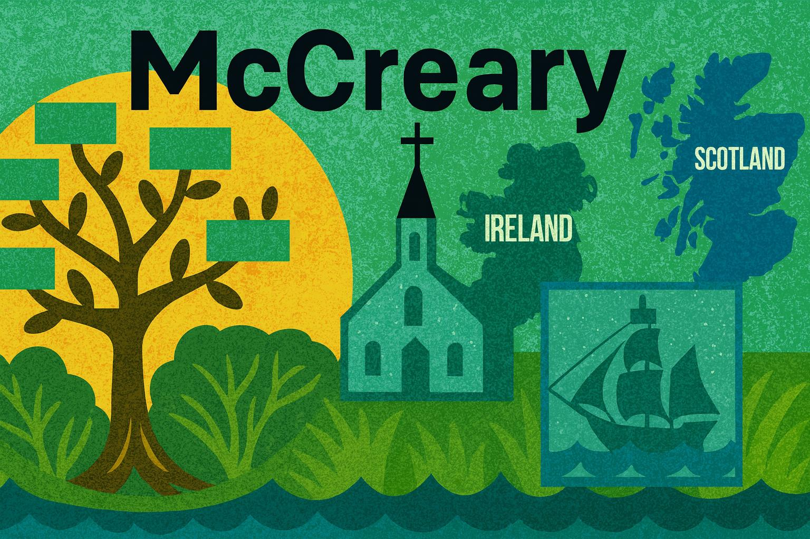

Welcome to the McCreary family heritage site.  The goal of this site
is to store resources related to educating people about the McCreary
family history and their migration from Scotland, and Ireland to locations
around the world.  We don't simply store genealogical data.  We also
use web-based tools to alow students to explore this information.

Please see the [About](./about.md) page for more details about this site.

Please contact me on [LinkedIn](https://www.linkedin.com/in/danmccreary/) if
you have any comments, feedback or suggestions on how we can improve the site.

- Dan McCreary, October 2025

