# From Majestic Cathedrals to Moss Covered Ruins

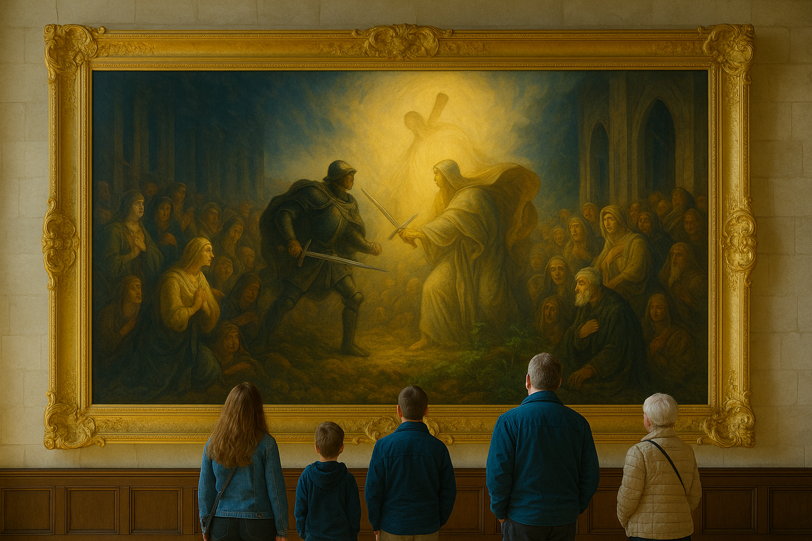

As we toured Scotland, many of the castles contained huge paintings that glorified the
battles of the clans of Scotland.  Although many of the paintings were battles of the clans against 
the repressive English government, many were about clans fighting each other
about their different religions.  Both sides believed that God was on their side.
Hundreds of thousands of people died in these wars.

But as we traveled around Scotland, we notices something somewhat interesting.  People
were not fighting each other over religion any more.  In fact quite the opposite.
Churches were mostly empty, and many in a state of disrepair.  What was their story?

## Closed Churches
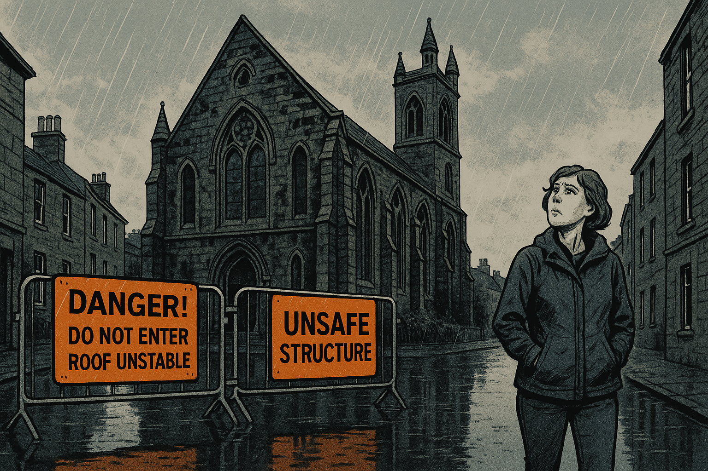

   
Show image description

   Please generate a wide landscape drawing of this scene using a graphic-novel style drawing.
   Make sure that each image is consistent with the style of prior images.

   A contemporary Scottish street scene showing a beautiful but weathered stone church from the 1800s. The church has Gothic architecture with pointed arch windows and a tall bell tower. In the foreground, bright orange and black warning signs are prominently displayed on metal barriers: "DANGER! DO NOT ENTER - ROOF UNSTABLE" and "UNSAFE STRUCTURE". A middle-aged woman in modern clothing (jeans and a rain jacket) stands looking up at the church with a puzzled, concerned expression. Rain falls lightly, and puddles reflect the grey Scottish sky. The church's stonework shows dark water stains and patches of moss.

Why are so many of Scotland's beautiful old churches abandoned with warning signs? What happened to these once-vital centers of community life?"

## Scotland's Sacred Past
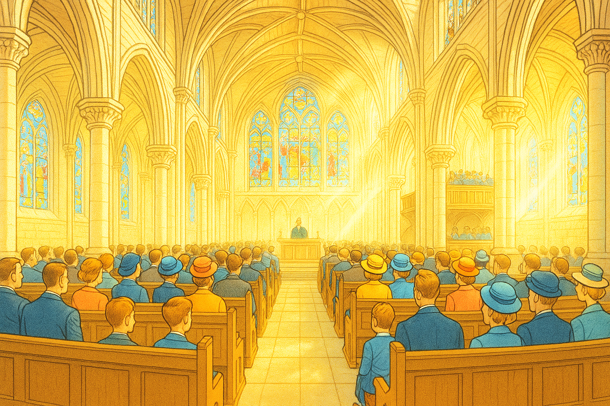

   
Show image description

   Please generate a wide landscape drawing of this scene using a graphic-novel style drawing.
   Make sure that each image is consistent with the style of prior images.

   A flashback scene to the 1950s showing the interior of a magnificent Scottish cathedral during Sunday service. The view looks down the central nave toward the altar, with soaring vaulted ceilings, elaborate stone columns, and brilliant stained glass windows casting colored light across the space. The pews are completely filled with well-dressed congregants - men in suits, women in hats and Sunday dresses, children in their best clothes. A choir in robes sings from the loft. The atmosphere is reverent and majestic, with dust motes visible in shafts of colored sunlight. The architectural details are ornate and beautifully maintained.

For centuries, Scotland's churches were the heart of every community. Magnificent cathedrals and humble parish churches alike drew crowds every Sunday. Faith was woven into the fabric of Scottish life."

## The Long Decline

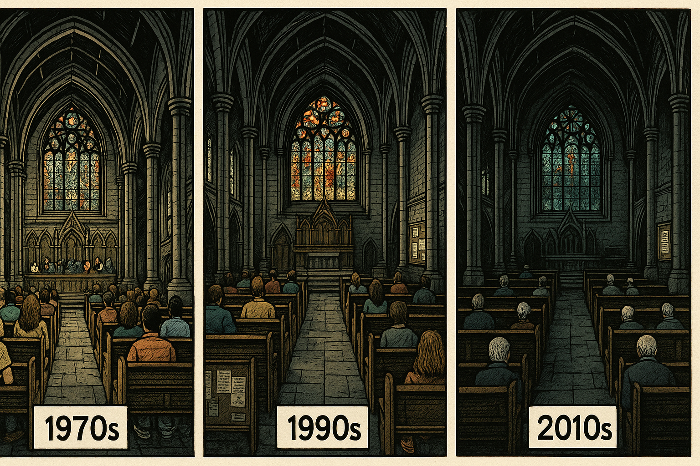

   
Show image description

   Please generate a wide landscape drawing of this scene using a graphic-novel style drawing.
   Make sure that each image is consistent with the style of prior images.

   A split-panel montage showing the same church interior across different decades. On the left, the 1970s with moderately full pews (about 60% capacity), people in more casual clothing. In the center, the 1990s with only 30% of pews filled, showing more empty space. On the right, 2010s with just scattered individuals and families (about 15% capacity) - mostly elderly people with grey hair. Each time period is subtly indicated by changing fashion styles and a calendar visible on a notice board. The lighting gradually becomes dimmer, and the congregation visibly ages and shrinks across the decades.

But attendance began dropping in the 1960s and never stopped. Each generation attended less than the one before. The pews grew emptier year by year.

## Before the Pandemic
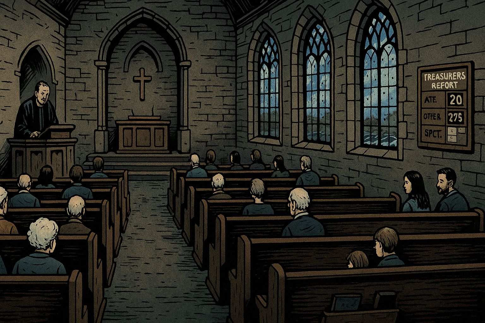

   
Show image description

   Please generate a wide landscape drawing of this scene using a graphic-novel style drawing.
   Make sure that each image is consistent with the style of prior images.

   A 2020 pre-COVID Sunday service scene showing a medium-sized stone church interior with Gothic windows. Only about 9% of the pews are occupied - roughly 20-25 people scattered throughout a space designed for 250. The congregants are predominantly elderly with white and grey hair. A tired-looking minister in robes stands at the pulpit. A young couple with a child sits near the back, looking somewhat out of place among the elderly majority. The treasurer's report board on the wall shows declining numbers. Through the windows, modern cars are visible in the parking lot. The space feels vast and echo-y.

By 2020, just before COVID struck, only 9% of Scots attended church regularly. The faithful remnant was mostly elderly - people who had attended all their lives and wouldn't stop now.

## The Pandemic's Devastating Impact
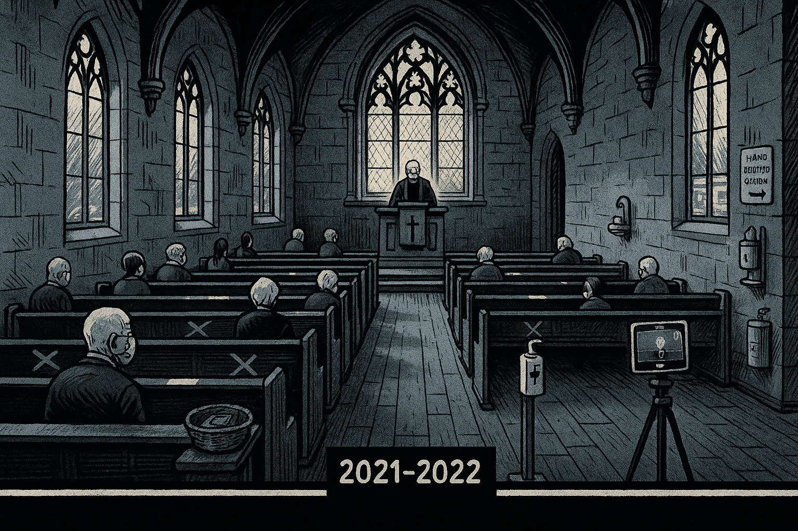

   
Show image description

   Please generate a wide landscape drawing of this scene using a graphic-novel style drawing.
   Make sure that each image is consistent with the style of prior images.

   A 2021-2022 scene showing an even more sparsely attended service during the post-COVID period. Only about 10-12 elderly people are present in the same large church, many sitting alone with empty pews around them. Everyone wears masks. Hand sanitizer stations are visible. Social distancing markers are taped on the pews. The minister conducts the service to nearly empty rows. An iPad on a tripod live-streams to an audience of zero viewers. A donation basket by the door has only a few bills. The atmosphere is somber and lonely. Grey light filters through the windows.

After COVID, attendance collapsed to just 4%. Many elderly parishioners never returned - some had died, others stayed home permanently. Those who remained were mostly pensioners on fixed incomes with little money to spare for donations.

<iframe src="../../sims/religion/main3.html" height=580></iframe>

## The Budget Crisis
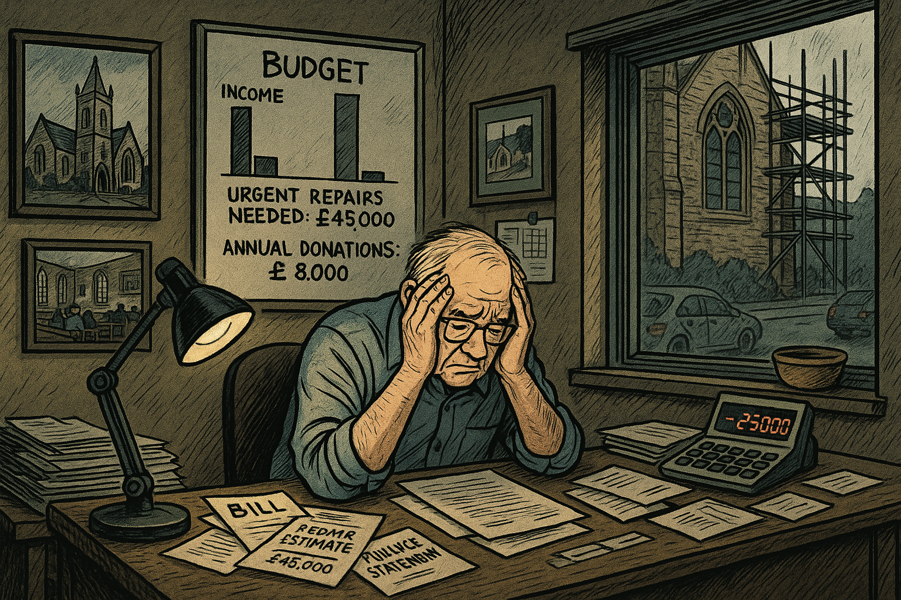

   
Show image description

   Please generate a wide landscape drawing of this scene using a graphic-novel style drawing.
   Make sure that each image is consistent with the style of prior images.

   A church office scene showing a church treasurer (an elderly man with glasses) sitting at a cluttered desk covered with bills, repair estimates, and financial statements. He holds his head in his hands in despair. A calculator shows red numbers. Behind him, a whiteboard displays a budget with income far below expenses, with "URGENT REPAIRS NEEDED: £45,000" and "ANNUAL DONATIONS: £8,000" clearly visible. Photographs on the wall show the same church in better times. Through the window, scaffolding can be seen on part of the church building. The lighting is dim and depressing, lit by a single desk lamp.

Without enough members, church budgets collapsed. The math was brutal: medieval buildings require constant expensive maintenance, but donations now barely cover heating and the minister's salary. There was nothing left for repairs.

## The Rot Begins
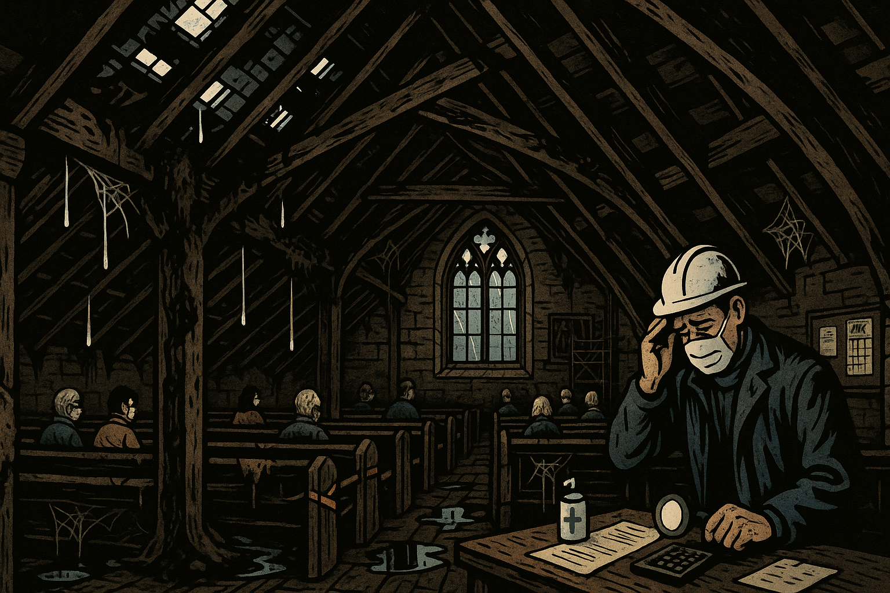

   
Show image description

   Please generate a wide landscape drawing of this scene using a graphic-novel style drawing.
   Make sure that each image is consistent with the style of prior images.

   A dramatic cutaway view showing the church's roof structure from inside the attic space. Water drips through multiple holes in the slate roof, with dark water stains spreading across the ancient timber beams. The wooden support beams show visible rot - dark, crumbling sections where the wood has turned soft and black. Fungal growth is visible on some timbers. Puddles have formed on the floor below. Spider webs hang between the beams. The scene is dark and ominous, lit by shafts of daylight coming through the roof holes. A roofer in a hard hat inspects the damage with a flashlight, shaking his head.

Once the money ran out, small leaks went unrepaired. Scottish rain poured through gaps in the roof, soaking the medieval timber frames. The ancient wood, dry for centuries, began to rot with alarming speed.

## Falling Tiles
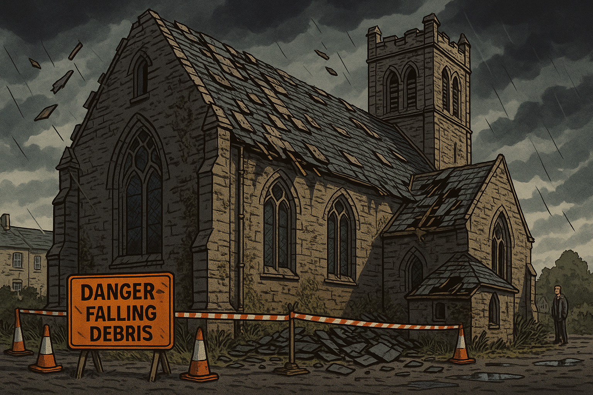

   
Show image description

   Please generate a wide landscape drawing of this scene using a graphic-novel style drawing.
   Make sure that each image is consistent with the style of prior images.

   An exterior view of the church from the side, showing the roof in deteriorating condition. Heavy slate tiles have fallen from the roof and lie shattered on the ground around the church building. More tiles are visibly loose, hanging at dangerous angles. Some have crashed through a side extension's roof. The church walls show impact damage where tiles have struck. Orange safety cones and warning tape surround the building's perimeter. A "DANGER - FALLING DEBRIS" sign is prominent. In the background, a concerned neighbor looks on from a safe distance. Dark storm clouds gather overhead. Weeds grow tall around the base of the building.

As the roof timbers weakened, heavy slate tiles began to fall. Each tile weighed several kilograms - deadly projectiles crashing to the ground below. The buildings became dangerous to approach, forcing closure."

## Collapse and Reclamation
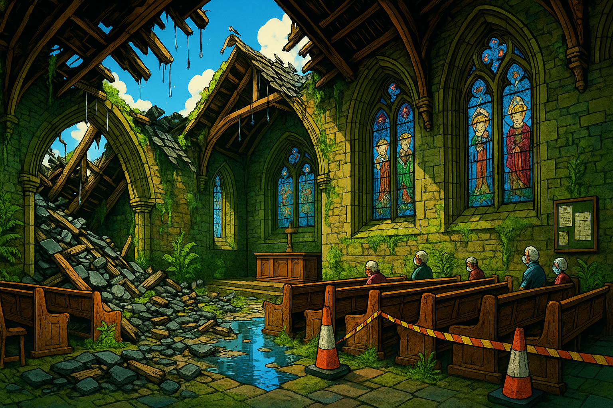

   
Show image description

   Please generate a wide landscape drawing of this scene using a graphic-novel style drawing.
   Make sure that each image is consistent with the style of prior images.

   Make this image be much brighter and more full of rich color than the prior images.

   A devastating interior scene showing partial roof collapse inside the church sanctuary. A large section of the ceiling has caved in, with broken timbers, slate tiles, and stone rubble covering the pews below. Bright sunlight streams through the gaping hole in the roof. Bright green moss has begun growing on the wet wood and stone. Ferns sprout from cracks in the walls. Pigeons roost on the exposed beams. Water pools on the floor, reflecting the bright blue sky above. The stained glass windows remain intact but are covered in grime. The altar area is relatively undamaged but abandoned. The scene is both tragic and eerily beautiful as verdent green nature reclaims the space.

Without repairs, the inevitable happened. Ceiling sections collapsed inward. Scottish rain and wind now pour freely inside. Moss quickly colonized the damp stonework, covering surfaces that had been dry for 800 years.

## From Cathedral to Ruin
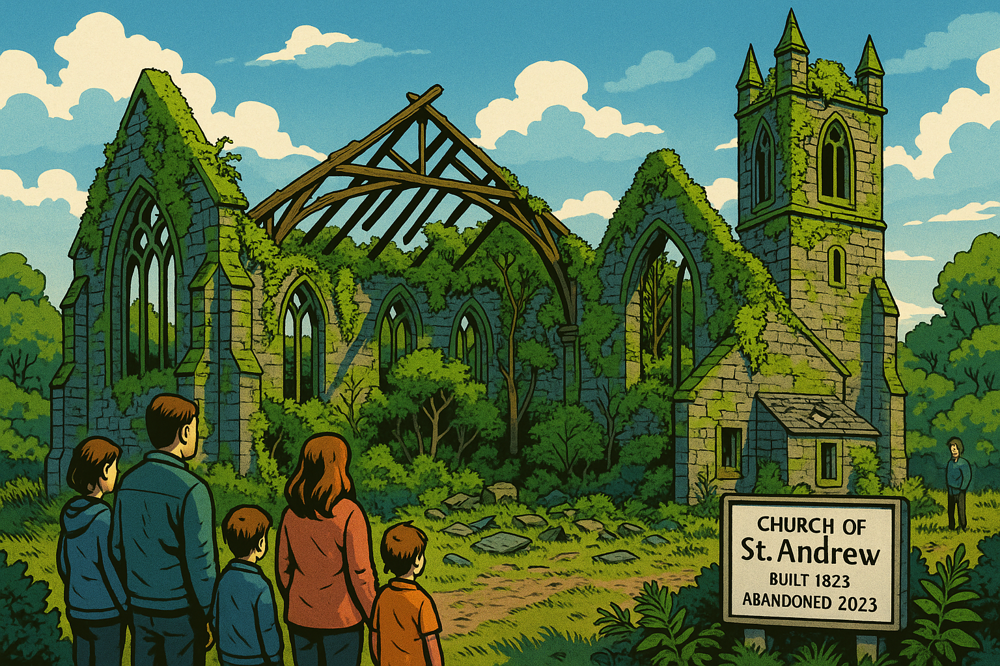

   
Show image description

   Please generate a wide landscape drawing of this scene using a graphic-novel style drawing.
   Make sure that each image is consistent with the style of prior images.

   A wide landscape view showing the same church from Panel 1, but now in an advanced state of ruin just a few years later. The roof is mostly gone, with only skeletal timber beams remaining. The bell tower stands but is covered in moss and vegetation. Trees and bushes grow inside the roofless nave. The Gothic windows are still beautiful but frame open sky instead of stained glass. The stonework is thick with moss and ivy. The building now resembles the ancient medieval ruins that tourists visit. In the foreground, a modern Scottish family - parents and two children - stand looking at the ruin with sadness. A historic information plaque has been erected: "Church of St. Andrew, Built 1823, Abandoned 2023." The scene has a melancholic beauty.

In just five to ten years, churches that stood proud for centuries now look like ancient ruins. 
Scotland's religious collapse happened not over centuries, but in a single generation. 
These aren't medieval ruins - they're the fresh casualties of our secular age.

## Epilogue

This story reflects the real crisis facing Scotland's historic churches. 
Between 2020 and 2024, church attendance dropped by more than half. 
Over 300 Church of Scotland buildings are now at risk of closure or demolition. 
The architectural heritage of a nation crumbles not from ancient age, but from modern abandonment.
Here is an example of a 1,000 year old church and abby you can purchase for [about $50,000](https://www.churchofscotland.org.uk/about-us/departments/property-and-church-buildings/properties-for-sale/properties/churches-and-halls/culross-abbey-kirk-street-culross-ky12-8jd).

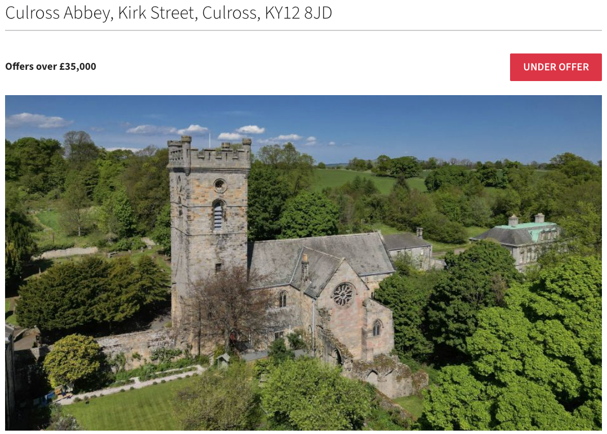

## References and Further Study

### The Decay of Religion and Churches in Scotland

The following references have been choses for a high-school audience.

1. [Church of Scotland membership falls below 300,000 for first time](https://www.bbc.com/news/uk-scotland-65755550) - May 2023 - BBC News - Official statistics showing the dramatic decline in Church of Scotland membership, dropping below 300,000 members for the first time in its history. Provides concrete numbers demonstrating the scale of religious decline discussed in the graphic novel.

2. [Scotland's churches face closure crisis as attendance plummets](https://www.theguardian.com/world/2023/jan/15/scotland-churches-closure-crisis-attendance-plummets) - January 2023 - The Guardian - Investigative report on the financial and attendance crisis facing Scottish churches, including interviews with ministers and detailed statistics on post-COVID attendance drops that mirror the story's narrative.

3. [Historic Scottish churches at risk of demolition due to falling congregations](https://www.heraldscotland.com/news/23103847.historic-scottish-churches-risk-demolition-due-falling-congregations/) - November 2023 - The Herald Scotland - Examines the architectural heritage crisis as historic church buildings face demolition, directly relevant to the story's theme of magnificent buildings becoming ruins.

4. [COVID-19's lasting impact on church attendance in Scotland](https://www.scotsman.com/news/covid-19s-lasting-impact-on-church-attendance-in-scotland-3984521) - October 2022 - The Scotsman - Analysis of how the pandemic accelerated church attendance decline in Scotland, with specific focus on elderly parishioners who never returned, as depicted in Panel 5.

5. [The maintenance crisis: Scotland's crumbling church buildings](https://www.buildingconservation.com/articles/church-buildings-scotland/church-buildings-scotland.htm) - 2023 - Building Conservation - Technical article explaining the maintenance challenges and costs of historic church buildings, including roof repairs and timber rot—the exact problems illustrated in Panels 6-7.

6. [Secularization in Scotland: A statistical overview](https://www.nrscotland.gov.uk/statistics-and-data/statistics/statistics-by-theme/population/population-estimates/2011-census/religion) - 2022 - National Records of Scotland - Official census data showing long-term trends in religious affiliation and practice in Scotland, providing historical context for the decline shown in Panel 3.

7. [Church of Scotland loses 260 buildings in five years](https://www.thetimes.co.uk/article/church-of-scotland-loses-260-buildings-in-five-years-z9wg9dzkt) - March 2024 - The Times - Recent reporting on the rapid closure and disposal of church properties, documenting the speed of decline depicted in the story's timeline.

8. [Why are Scotland's churches emptying?](https://www.bbc.com/news/uk-scotland-58934444) - October 2021 - BBC News - Feature article exploring the social, cultural, and generational factors behind declining church attendance in Scotland, providing context for understanding the story's themes.

9. [The cost of maintaining historic religious buildings in the UK](https://historicengland.org.uk/advice/caring-for-heritage/places-of-worship/) - 2023 - Historic England - Practical guide discussing the financial challenges of maintaining historic religious buildings, relevant to understanding the budget crisis depicted in Panel 6.

10. [From pews to ruins: Documenting Scotland's abandoned churches](https://www.architecturalheritage.scot/abandoned-churches-scotland/) - 2023 - Architectural Heritage Society of Scotland - Photographic documentation and analysis of abandoned and deteriorating church buildings across Scotland, visual evidence supporting the transformation shown in Panels 8-10.

### Major Religious Conflicts and Death Tolls in Scotland

It's challenging to provide an exact total death toll from religious conflicts in Scotland over 1,000 years, as historians note that accurate casualty figures are often difficult to determine or assemble. However, I can share information about the major documented religious conflicts:

#### Wars of the Three Kingdoms (1639-1653)
This was one of the bloodiest episodes in Scottish history. Estimates indicate around 15,000 civilians died as a direct result of the war through massacres or disease, with another 30,000 dying from plague between 1645 and 1649, partly spread by troop movements. Additionally, at least 20,000 Scottish soldiers died fighting in civil wars in England and Ireland during this period.

Military deaths were likely even higher than direct combat casualties, as disease typically killed three times as many soldiers as combat did during this era.

#### The Killing Time (1679-1688)
During this period of persecution of Presbyterian Covenanters, around 100 executions were recorded as a result of the Privy Council's orders, with the majority being radical Cameronians executed over several months in 1685. At the Battle of Bothwell Bridge in 1679, 800 Covenanters were killed.

#### Other Conflicts
The broader Wars of the Three Kingdoms (which included England and Ireland) caused about 85,000 combat deaths in England and Wales, with a further 127,000 noncombat deaths including about 40,000 civilians.

#### Why Exact Numbers Are Difficult
Historians face several challenges in calculating total deaths from religious conflicts:
- Many deaths were indirect (disease, famine) rather than direct combat
- Record-keeping was incomplete, especially for civilian casualties
- The definition of "religious persecution" varies—some count only state executions, others include all conflict deaths where religion played a role

**In summary**: While we cannot provide a precise 1,000-year total, the documented evidence shows that Scotland's major religious conflicts in the 17th century alone likely resulted in **hundreds of thousands of deaths**, with the Wars of the Three Kingdoms (1639-1653) representing the bloodiest period.

### Chat Logs

* [Claude Sonnet 4.5 for the Narrative](https://claude.ai/share/f06296df-a2ac-4903-b0c5-dabac35a0365)
Note: I neglected to put the figure number into the template
* [OpenAI Image Generation](https://chatgpt.com/share/68e95a4e-a3a0-8001-ba3f-e8f18fe26938)