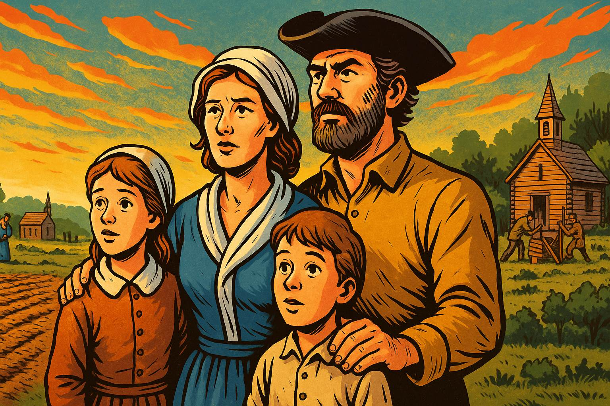

# McCreary Family Stories

## McCreary's Journey
{width=400px}

The McCreary family's journey from Scotland to Ulster to America spans over a century of religious conflict, colonization, and the search for freedom. In the early 1600s, Scottish Presbyterian families like the McCrearys were recruited by King James I to settle confiscated lands in Ulster, Ireland, as part of the Ulster Plantation scheme designed to establish Protestant control over Catholic Ireland. They built prosperous farms and communities, but the deep resentment of displaced Irish Catholics erupted in the devastating 1641 Rebellion, which killed thousands of Protestant settlers and shattered any hope of peaceful coexistence. Oliver Cromwell's brutal reconquest from 1649-1653—marked by infamous massacres at Drogheda and Wexford—crushed Irish resistance and secured Protestant dominance through massive land confiscations that reduced Catholic holdings from 60% to just 20% of Ireland. However, victory proved bittersweet for the Presbyterian Scots: despite their sacrifices defending the plantation, they faced discrimination under the Anglican-controlled Test Acts and Penal Laws, which barred them from public office, refused to recognize their marriages, and subjected them to economic hardship through rising rents and tithes. By the 1710s-1720s, worn down by religious persecution from above, Catholic resentment from below, and devastating droughts and economic crises, thousands of Ulster Scots including the McCrearys decided to try their luck once more, crossing the Atlantic to Pennsylvania and the American frontier where they finally found the religious freedom, cheap land, and opportunity that had eluded them for a century—becoming the quintessential American frontiersmen who would help define the character of the early United States.

[Read the McCreary's Journey Story](./mccrearys-journey/index.md)

## Majestic Cathedrals to Moss Covered Ruins

{width=400px}

*From Majestic Cathedrals to Moss Covered Ruins* tells the tragic story of Scotland's rapid religious collapse through the fate of its historic churches. Once filled with worshippers, these magnificent buildings saw attendance decline steadily from the 1960s onward, dropping to just 9% of the population by 2020. The COVID-19 pandemic delivered the final blow, cutting attendance in half to 4%—mostly elderly parishioners on fixed incomes with little money to donate. Without sufficient funds for maintenance, small roof leaks went unrepaired, causing medieval timber frames to rot. Heavy slate tiles began falling, creating dangerous conditions that forced closures. Within just a few years, churches that stood proud for centuries collapsed inward, their interiors now open to Scottish rain and wind, covered in moss and vegetation—transformed from active houses of worship into fresh ruins that mark not ancient history, but the swift secularization of a nation within a single generation.

[Read the Majestic Cathedrals to Moss Covered Ruins Story](./churches/index.md)