# The McCreary Journey: From Scotland to Ulster to America
## A 14-Panel Graphic Novel

## Panel 1: The Wild Green Isle (Ireland, 1600)
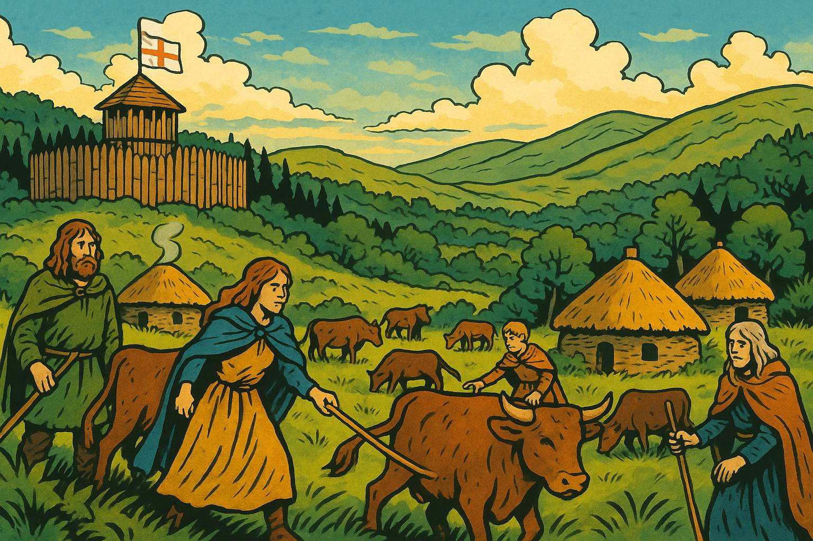

Show image description

Please generate a wide landscape drawing of this scene using a graphic-novel style drawing. Use a bright palette of colors. Make sure that each image is consistent with the style of prior images.

Show the lush, wild Irish countryside of Ulster around 1600. In the foreground, Gaelic Irish families tend cattle in communal fields, their traditional clothing and thatched roundhouses visible. In the middle ground, a wooden palisade fort sits on a hill, flying the English flag. In the background, dense forests and rolling green hills stretch to the horizon. The scene should feel both beautiful and untamed, with a sense of tension between the native Irish way of life and the distant English presence.

Before the plantations, Ulster was a land of cattle raids, bardic poetry, and Gaelic lords who weren't particularly interested in English ideas about "proper" land ownership. The English controlled some coastal forts and towns, but mostly they just watched nervously from their wooden walls while the Irish did their own thing. Think of it as a very long, very green standoff—except one side had Shakespeare and the other had significantly better cattle.

## Panel 2: The Flight of the Earls (1607)
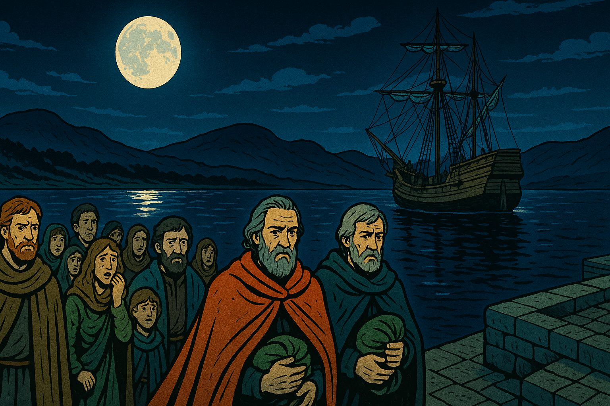

Show image description

Please generate a wide landscape drawing of this scene using a graphic-novel style drawing. The width:height ratio is 16:9.  Use a bright palette of colors. Make sure that each image is consistent with the style of prior images.

Depict a moonlit Irish harbor with a ship preparing to depart. In the foreground, Hugh O'Neill and other Irish earls in fine cloaks walk toward the vessel, carrying small bundles—all that remains of their possessions. Behind them, their followers and family members watch with expressions of sorrow and disbelief. In the background, the dark outline of Ulster's hills looms. The mood should be melancholy but dramatic, with the moon creating a silver path on the water leading away from Ireland.

When Ulster's Gaelic lords—including the mighty Hugh O'Neill—realized they couldn't win against English expansion, they pulled off history's most consequential Irish goodbye. In 1607, they sailed for continental Europe, abandoning four million acres and their people. King James I looked at all that empty land and had what he considered a brilliant idea: "Let's fill it with Scots!" History would prove this decision... complicated.

## Panel 3: The Plan Takes Shape (1609)
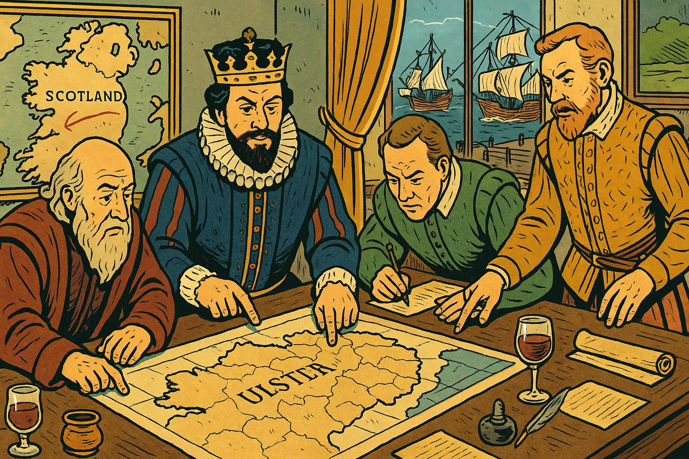

Show image description

Please generate a wide landscape drawing of this scene using a graphic-novel style drawing. The width:height ratio is 16:9.  Use a bright palette of colors. Make sure that each image is consistent with the style of prior images.

Show an elaborate planning room in London with maps of Ulster spread across a large table. King James I and his advisors point at different regions, dividing the land into neat parcels. On the walls hang maps showing Scotland and Ireland, with lines drawn between them. Through the window, we can see both Scottish and English ships being prepared. The scene should emphasize the clinical, bureaucratic nature of the plantation scheme—men in fancy clothing casually redesigning an entire country over wine and documents.

The Ulster Plantation wasn't some spontaneous land grab—it was meticulously planned, right down to the required dimensions of defensible buildings. The scheme promised Scottish and English "undertakers" cheap land, but with conditions: build stone houses, create fortified settlements, and absolutely *do not* rent to the native Irish. It was social engineering on a massive scale, designed to transform Ulster from Gaelic and Catholic to British and Protestant. What could possibly go wrong?

## Panel 4: The McCrearys Cross the Sea (1610-1620)
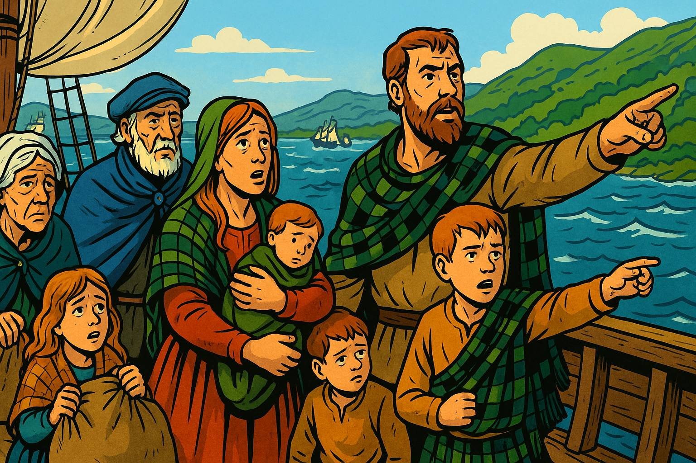

Show image description

Panel 4
Please generate a wide landscape drawing of this scene using a graphic-novel style drawing. The width:height ratio is 16:9.  Use a bright palette of colors. Make sure that each image is consistent with the style of prior images.

Illustrate a small sailing vessel crossing the narrow North Channel between Scotland and Ireland. On deck, a McCreary family—parents, children, and elderly grandparents—clutch their belongings while pointing toward the green coast of Ulster emerging from the mist. The sea is choppy but manageable. Behind them, the Scottish coast fades away; ahead, their new home awaits. Include a few other ships in the background, showing this was part of a larger migration. The family's expressions should mix hope, apprehension, and seasickness in equal measure.

For lowland Scots like the McCrearys, Ulster was a tempting opportunity—only 13 miles across the water at the narrowest point, cheaper than that morning's ferry to Belfast. They arrived by the thousands, carrying their Presbyterian faith, their agricultural skills, and their deep suspicion of both Catholic Irish and Anglican English. The McCrearys settled their granted lands, built their stone farmhouses, and promptly discovered that "no Irish tenants" rule was completely unenforceable. Turns out you need workers, and the Irish were already there.

## Panel 5: Building a New Life (1620s-1630s)
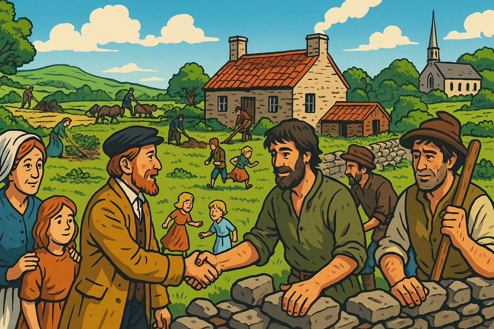

Show image description

Panel 5
Please generate a wide landscape drawing of this scene using a graphic-novel style drawing. The width:height ratio is 16:9.  Use a bright palette of colors. Make sure that each image is consistent with the style of prior images.

Show a newly constructed stone farmhouse and outbuildings in Ulster. The McCreary family works alongside Irish laborers in the fields—despite the official rules. A Presbyterian church is visible in the middle distance. The scene includes women tending gardens, children playing, men building a stone wall, and smoke rising from chimneys. The architecture is distinctly Scottish lowland style. In the foreground, show friendly but slightly awkward interaction between Scottish settlers and Irish workers—they're neighbors now, whether London likes it or not.

The McCrearys and their fellow Scots tried to create "New Scotland" in Ulster, complete with Presbyterian churches and stone-built villages. But reality was messier than London's plans: Scots needed Irish laborers, intermarriage happened, and some cultural exchange was inevitable. Still, the communities remained distinct—Presbyterians in their kirk, Catholics at mass, and everyone keeping one eye on their neighbors. It was less a melting pot than an uneasy stew.

## Panel 6: The Irish Perspective (1630s)
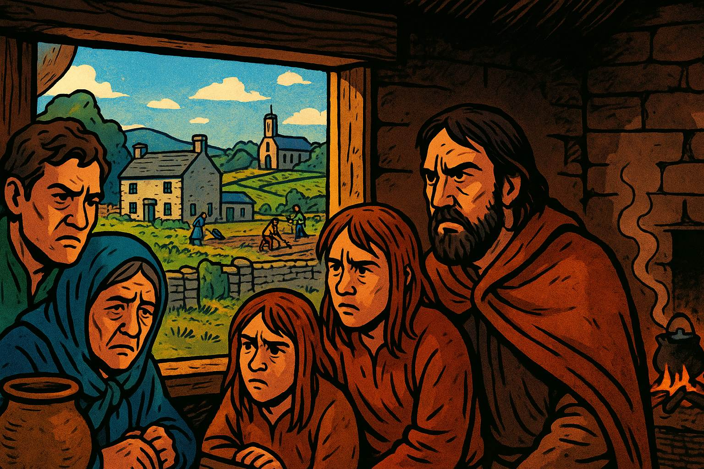

Show image description

Panel 6
Please generate a wide landscape drawing of this scene using a graphic-novel style drawing. The width:height ratio is 16:9.  Use a bright palette of colors. Make sure that each image is consistent with the style of prior images.

Depict an Irish Catholic family huddled in a small cottage, looking through a window at their former lands now occupied by Scottish settlers. Outside, we can see the stone houses and prosperous farms of the plantation. The Irish family's possessions are few; their expressions combine resentment, grief, and anger. In the background, show the contrast between their modest dwelling and the settler prosperity. Include subtle details showing they're now tenants or laborers on land their ancestors owned.

For the native Irish, the plantation was catastrophic. Their lords had fled, their lands were confiscated, and they found themselves reduced to tenants or laborers on their ancestral territories. The English and Scots weren't just taking land—they were importing a completely different social order, language, and religion. Imagine strangers showing up with legal documents saying they now own your farm, and you can work for them if you behave. The Irish Catholics didn't forget. They bided their time.

## Panel 7: The Rising Begins (October 1641)
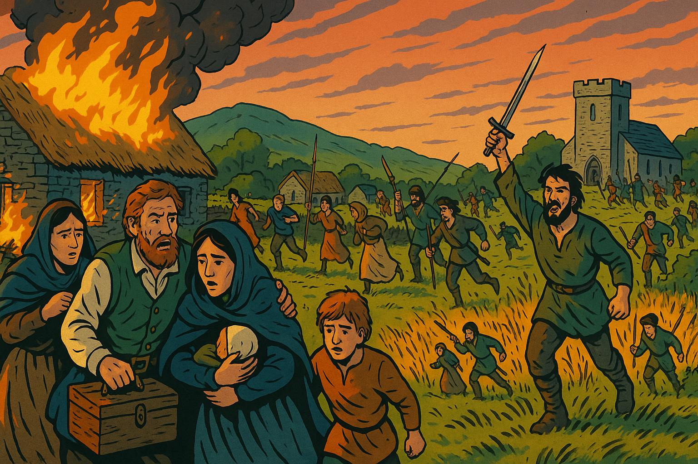

Show image description

Panel 7
Please generate a wide landscape drawing of this scene using a graphic-novel style drawing. The width:height ratio is 16:9.  Use a bright palette of colors. Make sure that each image is consistent with the style of prior images.

Show the dramatic moment of rebellion: Irish Catholic forces attacking a plantation settlement at dawn. In the foreground, families like the McCrearys flee their homes with whatever they can carry, their stone house burning behind them. Armed Irish rebels advance from the fields. Other Scottish settlers fight back or run toward a fortified church in the distance. The scene should be chaotic but not gratuitously violent—emphasize the panic, the smoke, the sudden reversal of fortune. Make it clear this is an organized uprising, not random violence.

In October 1641, after thirty years of simmering resentment, Ulster's Irish Catholics rose in coordinated rebellion. The plantation experiment exploded into violence as rebels attacked settlers, seeking to reclaim their lands and drive out the planters. Thousands of Scots and English were killed, more were stripped of possessions and driven from their farms. The McCrearys, like other Presbyterian families, fled to fortified towns or fought back desperately. What had been an uneasy coexistence became a sectarian bloodbath that would poison Ulster's soil for centuries.

## Panel 8: Enter Cromwell (1649)
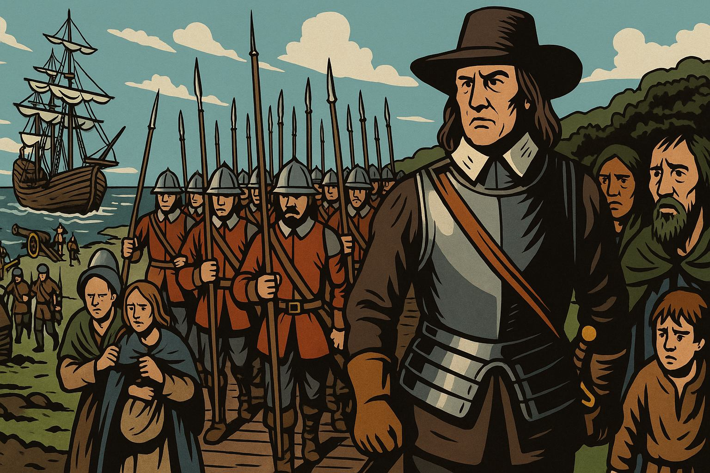

Show image description

Panel 8
Please generate a wide landscape drawing of this scene using a graphic-novel style drawing. The width:height ratio is 16:9.  Use a bright palette of colors. Make sure that each image is consistent with the style of prior images.

Illustrate Oliver Cromwell landing in Ireland with his New Model Army. Show him in his iconic armor and broad hat, standing on a ship's gangplank with disciplined soldiers marching off behind him in perfect formation. They carry pikes, muskets, and cannons. The soldiers look grim and purposeful, in stark contrast to the fearful Irish onlookers in the background. In the harbor, more ships unload supplies and troops. Cromwell's face should be stern, determined, and utterly uncompromising.

Eight years of chaos later, Oliver Cromwell arrived in Ireland with England's professional New Model Army and a divine mission to punish Irish "barbarism." The English Parliament wanted revenge for 1641, wanted Ireland firmly controlled, and wanted to pay their army with confiscated Irish land. Cromwell was happy to oblige—he believed he was doing God's work. The Irish were about to learn that sometimes the cure is worse than the disease.

## Panel 9: The Siege of Drogheda (September 1649)
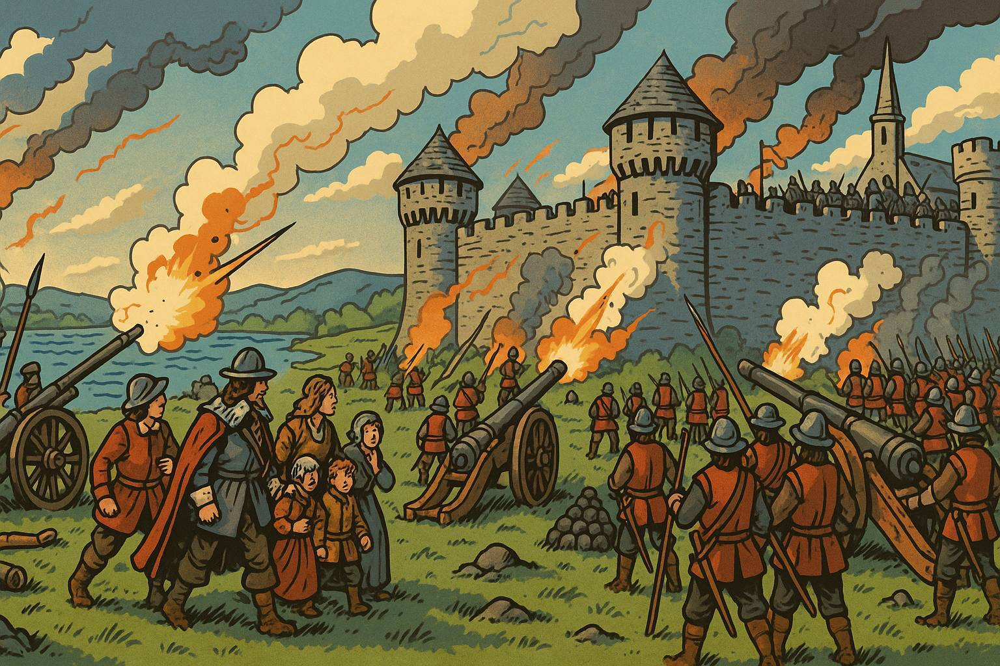

Show image description

Panel 9
Please generate a wide landscape drawing of this scene using a graphic-novel style drawing. The width:height ratio is 16:9.  Use a bright palette of colors. Make sure that each image is consistent with the style of prior images.

Show Cromwell's forces besieging the walled town of Drogheda. Depict the stone walls of the city, with smoke and cannon fire. Cromwell's artillery batters the defenses while his soldiers prepare to assault. Inside the walls, defenders man the ramparts. The scene should convey the overwhelming military power Cromwell commanded without showing graphic violence—emphasize the siege machinery, the professional army, the inevitable outcome. The composition should make clear that this is industrial-scale warfare, not a cattle raid.

When Drogheda's garrison refused to surrender, Cromwell made an example of them that would echo through Irish history. His forces stormed the walls and killed nearly the entire garrison—some 3,500 soldiers and many civilians. "I am persuaded that this is a righteous judgment of God," Cromwell wrote, apparently untroubled by conscience. He repeated the performance at Wexford weeks later. The message was clear: resistance would not be tolerated, and mercy was not on the menu.

## Panel 10: The Reconquest Complete (1653)
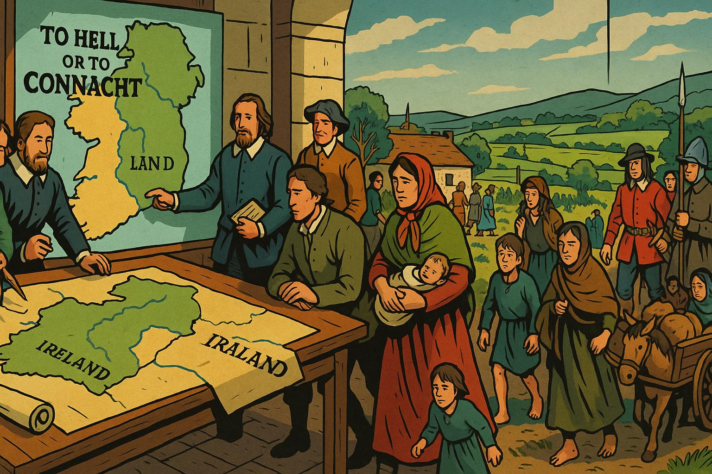

Show image description

Panel 10
Please generate a wide landscape drawing of this scene using a graphic-novel style drawing. The width:height ratio is 16:9.  Use a bright palette of colors. Make sure that each image is consistent with the style of prior images.

Depict the aftermath of Cromwell's conquest: a map of Ireland being redrawn by English administrators. Show them redistributing land, with Catholic landowners being pushed to marginal lands in Connacht ("To Hell or to Connacht" was the grim choice). In the foreground, Catholic families travel westward with their few possessions. In the background, Protestant settlers—including returning Presbyterian families like the McCrearys—move onto the newly redistributed lands. Include soldiers overseeing the transfers. The scene should convey the massive demographic engineering taking place.

By 1653, Cromwell's conquest was complete. Catholic landholding plummeted from 60% to 20% of Ireland. Thousands of Irish were killed, transported to the West Indies, or driven to marginal western lands. Protestant control—including the restored Ulster Plantation—was absolute. The McCrearys and other Presbyterian families returned to their lands, now more secure than ever. They had survived rebellion and reconquest. Surely now they could live in peace? (Narrator: They could not.)

## Panel 11: New Problems Emerge (1660s-1700s)
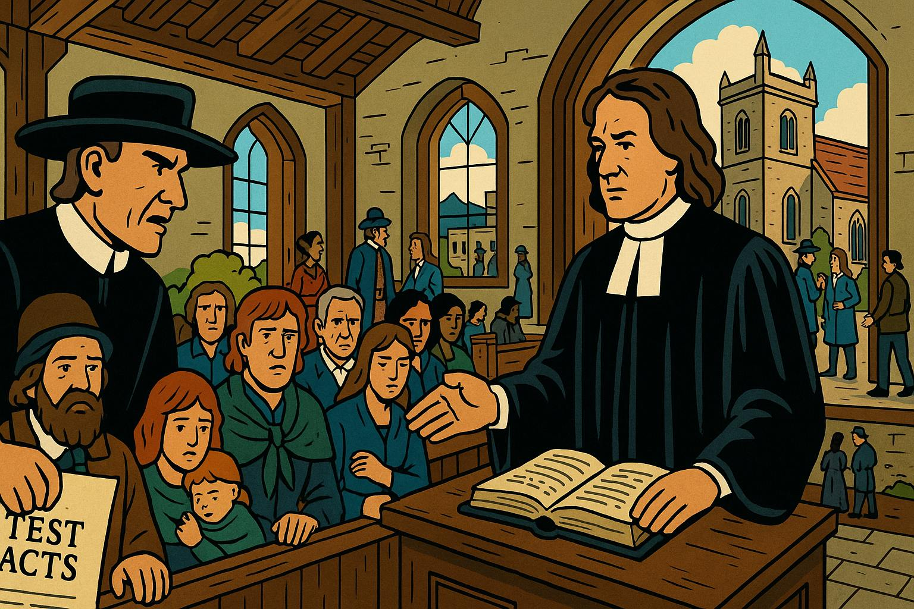

Show image description

Panel 11
Please generate a wide landscape drawing of this scene using a graphic-novel style drawing. The width:height ratio is 16:9.  Use a bright palette of colors. Make sure that each image is consistent with the style of prior images.

Show a Presbyterian church service being interrupted by Anglican officials. The McCreary family sits in the pews while a church official presents documents—the Test Acts that discriminate against Presbyterian dissenters. Outside the window, show an Anglican church with finer architecture. Include scenes of Presbyterians being denied political office, having their marriages questioned, and facing increased rents as plantation-era leases expire. The Presbyterians' faces should show frustration and growing disillusionment—they helped secure Protestant Ireland, but they're still second-class citizens.

Victory's sweetness was short-lived. The restored monarchy and Anglican establishment viewed Presbyterians as barely better than Catholics. The Test Acts barred them from political office. Their marriages weren't fully recognized. Their schools faced restrictions. And economically, as plantation leases expired, landlords jacked up rents mercilessly. The McCrearys had crossed the sea to escape religious discrimination, fought to defend their farms, and now found themselves squeezed between Catholic resentment below and Anglican condescension above. Ireland was beginning to feel like a bad investment.

## Panel 12: Why America? (1710s)
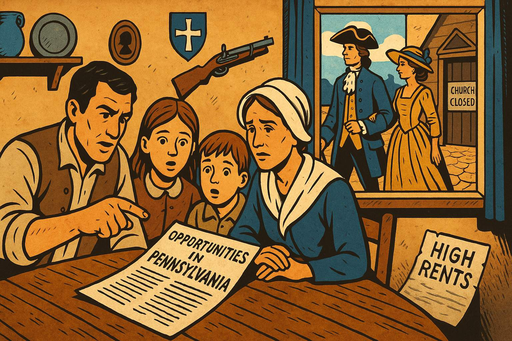

Show image description

Panel 12
Please generate a wide landscape drawing of this scene using a graphic-novel style drawing. The width:height ratio is 16:9.  Use a bright palette of colors. Make sure that each image is consistent with the style of prior images.

Show a Ulster Presbyterian family around their dinner table, with an open letter or pamphlet describing opportunities in Pennsylvania. On the walls, show the family's modest possessions and Presbyterian symbols. Through the window, wealthy Anglican neighbors pass by in fine clothing. The father points at the American pamphlet while the mother looks concerned but hopeful. Children listen with wide eyes. Include visual elements suggesting drought (cracked earth visible through window), high rents (a notice on the table), and religious restrictions (a closed church in the background).

By the 1710s, Ulster Presbyterians were reading letters from America that made Pennsylvania sound like the Promised Land: cheap land, religious freedom, no Anglican bishops, and no memory of 1641's bloodshed. When drought devastated Ulster's harvest in 1717-18, the decision became easy. The McCrearys, like thousands of Scotch-Irish families, decided that after a century of Scotland-to-Ireland, maybe Ireland-to-America would finally work out. Third time's the charm, right?

## Panel 13: The Atlantic Crossing (1717-1720)
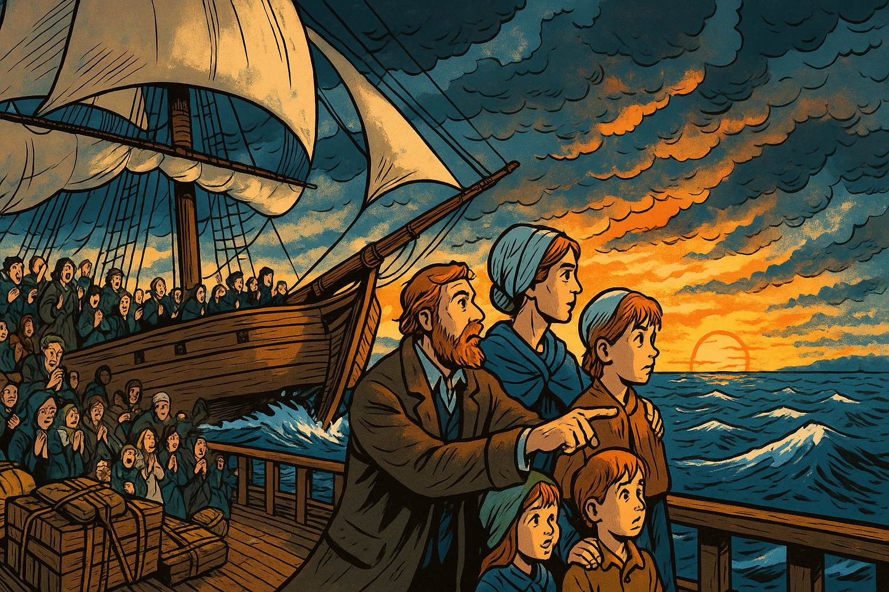

Show image description

Panel 13
Please generate a wide landscape drawing of this scene using a graphic-novel style drawing. The width:height ratio is 16:9.  Use a bright palette of colors. Make sure that each image is consistent with the style of prior images.

Illustrate a sailing ship crossing the Atlantic, cutting through rough seas. On deck, the McCreary family stands at the rail, looking westward toward the setting sun. Behind them, the Irish coast has long vanished. Their possessions are lashed to the deck. Other Presbyterian families crowd the ship—men, women, children, all leaving Ulster behind. Some pray, some sing Psalms, some look seasick. The composition should emphasize journey and transition—leaving one world for another. Make the sky dramatic with storm clouds parting to show clearer skies ahead (subtle metaphor alert!).

The Atlantic crossing took eight brutal weeks in cramped, disease-ridden ships. But the McCrearys and their fellow Ulster Scots were tough—they'd survived Scotland's religious persecution, Ireland's rebellion, Cromwell's conquest, and a century of discrimination. What's a little dysentery between friends? They sang Psalms, buried their dead at sea, and kept their eyes on Pennsylvania. They weren't called "Scotch-Irish" yet—that term would come later. But they already carried the fierce independence that would define America's frontier.

## Panel 14: New Beginnings (1720s Pennsylvania)
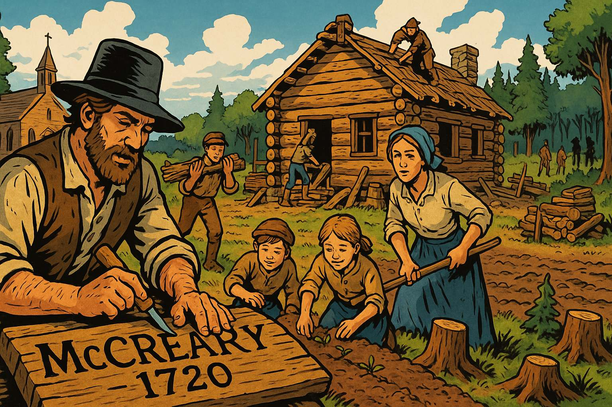

Show image description

Panel 14
Please generate a wide landscape drawing of this scene using a graphic-novel style drawing. The width:height ratio is 16:9.  Use a bright palette of colors. Make sure that each image is consistent with the style of prior images.

Show the McCreary family on their new Pennsylvania frontier farm. They're building a log cabin (very different from their Ulster stone house), clearing forest, and planting crops. A Presbyterian church is being constructed in the background. Native Americans are visible in the distant tree line—a reminder that this "empty" land has its own complicated history. The family looks tired but hopeful, working together. In the foreground, place a wooden sign the father is carving: "McCreary Farm, 1720." The scene should feel like both an ending and a beginning—three countries and a century of migration finally reaching (temporary) resolution.

The McCrearys settled in Pennsylvania's Cumberland Valley, then pushed south into Virginia and the Carolinas, becoming the quintessential American frontiersmen. They brought their Presbyterian faith, their whiskey-making skills, their fierce independence, and their experience with ethnic conflict (which, unfortunately, they'd apply to Native Americans). The journey from Scotland to Ulster to America had taken a century, but it created the "Scotch-Irish" character: stubborn, religious, suspicious of authority, and absolutely convinced they'd earned whatever they managed to hold onto. They'd finally found a place where nobody was above them telling them what church to attend. Of course, they'd soon fight another revolution about taxes, but that's a different graphic novel entirely.

## References

1. [Plantation of Ulster - Wikipedia](https://en.wikipedia.org/wiki/Plantation_of_Ulster) - Updated October 2025 - Wikipedia - Comprehensive overview of how King James I organized the colonization of Ulster starting in 1609, including details about Scottish settlers, land grants, and how the plantation changed Ulster's demographics. Excellent for understanding why the McCreary families were invited to Ireland.

2. [The Ulster Plantation - Ask About Ireland](https://www.askaboutireland.ie/reading-room/history-heritage/history-of-ireland/the-ulster-plantation/) - Educational resource - Ask About Ireland - Student-friendly explanation of how the Ulster Plantation brought Scottish and English settlers to Northern Ireland, including information about new towns, schools, and the changes these settlers brought to Irish society.

3. [Irish Rebellion of 1641 - Wikipedia](https://en.wikipedia.org/wiki/Irish_Rebellion_of_1641) - Updated October 2025 - Wikipedia - Detailed account of the 1641 uprising when Irish Catholics attacked Protestant settlers, including casualty estimates and the depositions (witness testimonies) that documented the violence. Essential for understanding why the rebellion happened and its impact on Scottish settlers.

4. [The 1641 Depositions Project - Trinity College Dublin](https://www.tcd.ie/history/research/1641.php) - Academic resource - Trinity College Dublin - Digital archive of witness testimonies from Protestant settlers who survived the 1641 rebellion, providing firsthand accounts of what families like the McCrearys experienced during this traumatic period.

5. [Cromwellian Conquest - Down Survey Project](https://downsurvey.tchpc.tcd.ie/history.html) - Historical resource - Trinity College Dublin - Explains Oliver Cromwell's 1649-1653 military campaign in Ireland, including the massacres at Drogheda and Wexford, and how his conquest led to massive land confiscations that reduced Catholic landholding from 60% to 20%.

6. [Cromwellian conquest of Ireland - Wikipedia](https://en.wikipedia.org/wiki/Cromwellian_conquest_of_Ireland) - Updated October 2025 - Wikipedia - Complete overview of Cromwell's reconquest, including military tactics, religious motivations, demographic losses (15-20% of Ireland's population), and the long-term establishment of Protestant control that made Ulster safer for Scottish settlers.

7. [Penal Laws (Ireland) - Wikipedia](https://en.wikipedia.org/wiki/Penal_laws_(Ireland)) - Updated August 2025 - Wikipedia - Describes the discriminatory laws passed after 1691 that restricted both Catholics and Presbyterian dissenters (like the McCrearys), explaining why Ulster Scots faced religious discrimination despite helping secure Protestant Ireland.

8. [Presbyterianism in the Eighteenth Century - Ulster Historical Foundation](https://ulsterhistoricalfoundation.com/the-scots-in-ulster/from-ulster-to-america/presbyterianism) - Historical resource - Ulster Historical Foundation - Explains how Presbyterians faced discrimination under the Test Acts, including having their marriages not recognized by the state and being barred from public office, which contributed to emigration to America.

9. [Scotch-Irish Americans - Wikipedia](https://en.wikipedia.org/wiki/Scotch-Irish_Americans) - Updated October 2025 - Wikipedia - Comprehensive article on the Ulster Scots migration to America (200,000+ people between 1717-1775), their settlement patterns in Pennsylvania and the frontier, and their influence on American culture, religion, and the Revolutionary War.

10. [Irish Immigration to America - Library of Congress](https://www.loc.gov/classroom-materials/immigration/irish/) - Educational resource - Library of Congress - Student-appropriate overview of Scotch-Irish immigration, explaining how these educated, skilled Presbyterian settlers from Ulster became pioneers in the middle colonies and migrated south along frontier routes, contributing significantly to early American development.